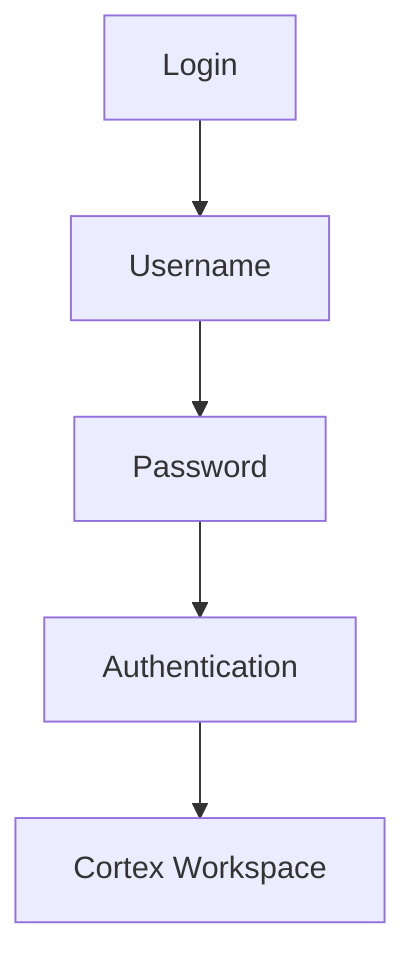
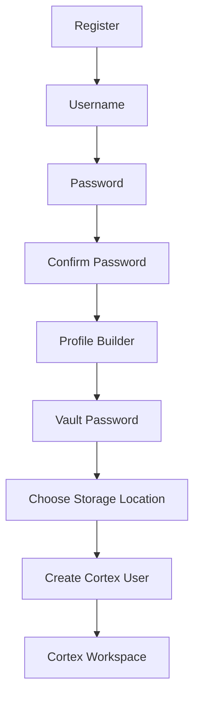
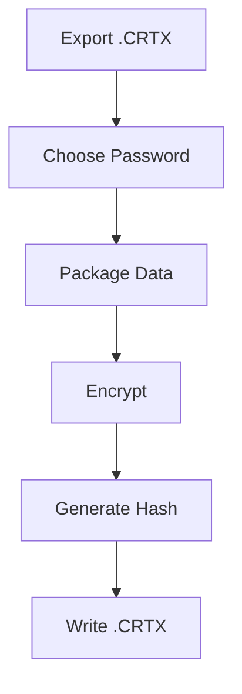
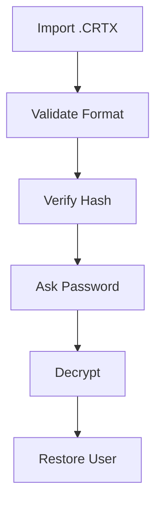
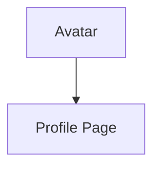
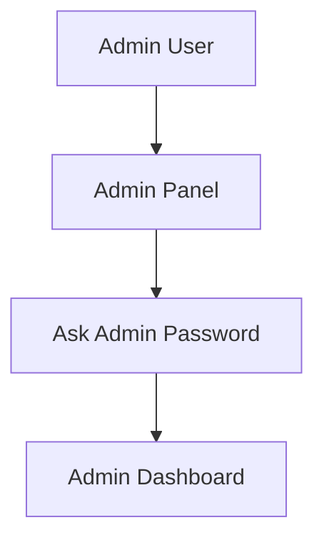
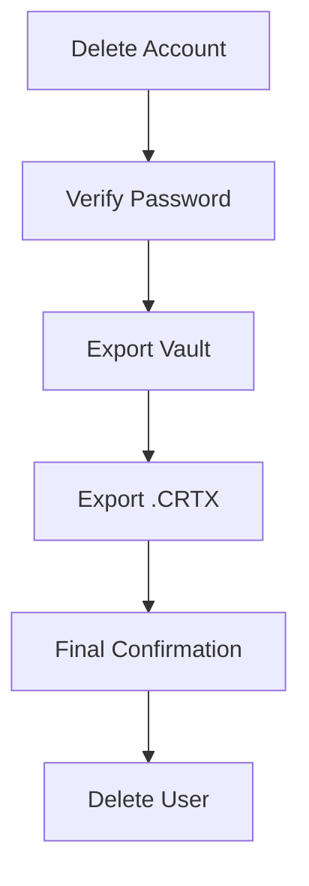

# 🧠 CORTEX WORKSPACE — SYSTEM DESIGN v1.0 (FINAL CONSOLIDATED PROPOSAL)

---

# 🌐 1. SYSTEM OVERVIEW

Cortex is a **personal cognitive operating system** designed to function as:

> A unified AI workspace combining memory, vault, chat intelligence, model orchestration, and execution systems — all centered around a persistent user identity.

Unlike traditional apps, Cortex is not login-driven SaaS.

It is:

- a **reconstructable intelligence environment**
- a **user-owned cognitive system**
- a **portable AI OS layer**

---

# 🚪 2. ENTRY SYSTEM — “RESONANCE GATE”

Instead of login/register screens, Cortex uses a symbolic entry system:

## 🧠 Entry Options

### 1. 🧬 “Identify Yourself”
- New user initialization
- Creates:
  - Cortex Identity
  - Settings profile
  - Vault root structure
  - Base memory system

---

### 2. 🧠 “Reawaken Cortex”
- Restore existing user session
- Loads:
  - settings
  - chat history
  - vault metadata
  - identity token

---

### 3. 📦 “Import Cortex Memory (.crtx)”
- Upload or specify file path of `.crtx`
- System reconstructs user environment

---

## 🧠 UI IDEA (LANDING PAGE)

Instead of traditional UI:

### Visual System:
- Neural cortex sphere (central core)
- DNA-like orbiting chains
- Synaptic particle network
- Dark reactive digital brain surface

### Animation States:
- Idle → calm neural pulsing
- Load → expanding signal waves
- Restore → reverse memory formation
- Active → stable rhythmic cognition

---

# 📦 3. `.CRTX` FILE SYSTEM

## 🧬 Definition

> `.crtx = Portable Cognitive Blueprint Archive`

It is NOT a full system dump.

It is a **structured reconstruction blueprint** of a user’s Cortex identity.

---

## ❌ NOT INCLUDED:
- SQLite DB dump
- FAISS/vector database
- raw filesystem data

---

## ✔ INCLUDED:
- user identity hash
- system configuration snapshot
- memory graph (compressed abstraction)
- execution summaries
- model preferences
- routing configuration
- vault metadata pointers
- version signature
- encryption signature

---

## 🧠 PURPOSE

`.crtx` enables:

- cross-device restoration
- identity continuity
- system reconstruction
- portable cognitive state transfer

---

# 🔁 4. CROSS-DEVICE MODEL

Cortex is designed for **reconstruction, not replication**.

## Flow:

```text
.crtx file → validation → decoding → blueprint extraction → system rebuild → user restored
````

## 🧠 KEY IDEA

> You do NOT move Cortex.
> You reconstruct Cortex.

---

## 🔄 Reconstruction steps:

1. Validate `.crtx` signature
2. Extract identity hash
3. Load user settings
4. Rebuild memory graph
5. Recreate vector index
6. Restore vault metadata
7. Reconnect chat history

---

# 🧠 5. DATA ARCHITECTURE MODEL

Cortex data is divided into 3 layers:

---

## 🟩 A. USER LAYER (PORTABLE — MOST IMPORTANT)

This is consistent across all devices:

### Includes:

* user identity
* settings
* chat history
* vault data
* preferences
* personalization state

---

## 🟦 B. SYSTEM LAYER (DEVICE DEPENDENT)

This is rebuilt per system:

### Includes:

* vector DB (FAISS / embeddings)
* model caches
* runtime execution state
* background indexing system
* local performance state

---

## 🟪 C. BLUEPRINT LAYER (.CRTX)

This is the transfer layer:

### Includes:

* compressed memory graph
* system configuration snapshot
* identity signature
* reconstruction instructions
* version metadata

---

# 🧠 6. VAULT SYSTEM (SECURE USER STORAGE)

## 🗂️ Concept

> Cortex Vault is a hidden encrypted storage system controlled entirely by Cortex.

It acts like a **private digital safe** inside the OS.

---

## 📥 Upload Flow

1. User uploads file
2. Cortex encrypts it

   * AES-256-GCM encryption
3. File stored in hidden vault structure
4. Metadata indexed (not raw file exposed)

---

## 📤 Retrieval Flow

1. User requests file
2. Cortex authenticates user
3. Key derived from password (KDF)
4. File decrypted inside Cortex runtime
5. File returned securely

---

## ❌ IMPORTANT CORRECTION

We explicitly reject:

* hashing for storage
* “reverse hash” recovery

✔ Instead we use:

> Real encryption (AES-256 + secure key derivation)

---

## 🔐 Vault Properties

* hidden system storage
* encrypted at rest
* Cortex-only access layer
* user-controlled decryption
* optional password binding

---

# 👤 7. USER DATA MODEL

User-specific persistent data includes:

---

## 🧠 Identity

* Cortex ID
* authentication fingerprint

---

## ⚙️ Settings

* UI preferences
* model selection behavior
* routing profiles
* memory behavior settings

---

## 💬 Chat History

* conversations
* AI responses
* execution traces
* session history

---

## 🗂️ Vault

* encrypted file storage
* metadata registry
* secure retrieval system

---

# 🧠 8. SYSTEM vs USER RESPONSIBILITY

---

## SYSTEM HANDLES:

* AI execution runtime
* model orchestration
* vector indexing
* performance optimization
* background services

---

## USER OWNS:

* identity
* memory
* chat history
* vault files
* settings

---

# 🚪 9. ENTRY FLOW (FINAL STATE MACHINE)

```text
User opens Cortex →

→ Resonance Gate UI loads

IF user exists:
    → restore session

IF .crtx uploaded:
    → validate file
    → decode blueprint
    → reconstruct user system

IF new user:
    → initialize identity
    → create vault
    → generate settings profile
```

---

# 🎨 10. FRONTEND EXPERIENCE DESIGN

## Core UI Philosophy:

> “Cortex is not an app — it is a living cognitive interface.”

---

## Visual Language:

* neural mesh networks
* digital DNA loops
* brain-like resonance field
* reactive AI glow system

---

## States:

* Idle → ambient neural motion
* Loading → reconstruction waves
* Active → stabilized cognition grid
* Vault → encrypted dark chamber UI
* Import → DNA decoding animation

---

# 🧠 11. CORE DESIGN PRINCIPLES

### ✔ Identity-first system

Everything revolves around user identity

### ✔ Portable cognition

User can move across devices

### ✔ Reconstruction over migration

System rebuilds state instead of copying

### ✔ Vault-first privacy

User files are encrypted and hidden

### ✔ System replaceable architecture

Backend can evolve without breaking user state

---

# 🧾 12. FINAL DECISION SUMMARY

✔ login/register removed
✔ replaced with Resonance Gate
✔ `.crtx` = cognitive blueprint archive
✔ `.crtx` supports upload OR file path import
✔ vault = encrypted secure file system
✔ system state is rebuildable
✔ user data is portable and dominant
✔ system data is ephemeral and replaceable
✔ cross-device support via reconstruction engine
✔ Cortex becomes personal AI OS, not SaaS

---

# 🚀 13. FINAL VISION

> Cortex is a self-contained cognitive operating system where identity, memory, and private vaults persist beyond devices, while the underlying system continuously rebuilds itself around the user.

---


No. For what you're trying to build, the document you currently have is only about **35-40% of the final Cortex specification**.

It explains the current backend well, but it does **not yet describe the actual Cortex product** you have now designed.

Your final master `.md` should become something closer to a **Software Requirements Specification (SRS) + System Design Document + Product Blueprint + Deployment Guide + Security Specification + Workflow Specification** combined.

---

# What We Have Fully Decided

## 1. Authentication System

### Entry Screen

User sees 3 options:

```text
+-----------------------+
|       CORTEX          |
+-----------------------+

[ Login ]

[ Register ]

[ Import .CRTX ]
```

---

## 2. Login Flow



Requirements:

* Username
* Password
* JWT Session
* Remember Session
* Logout

---

## 3. Register Flow



---

# 4. Three Password Strategy

We finalized:

## Password 1

### User Password

Used for:

* Login
* Account deletion
* Password changes

Never used for:

* Vault encryption
* .CRTX encryption

---

## Password 2

### Vault Password

Used for:

* Personal Vault encryption
* Opening vault
* Changing vault settings

Never used for:

* Login

---

## Password 3

### .CRTX Export Password

Used for:

* Exporting .CRTX
* Importing .CRTX

Never used for:

* Login
* Vault

---

# 5. Profile Builder

During registration:

```text
Name
Nickname
Bio
Description
Occupation
Skills
Interests
Preferences
Communication Style
AI Behavior Preferences
```

Purpose:

Personalization.

Not authentication.

---

# 6. Cortex Personality System

We decided Cortex should:

```text
Remember me
Adapt to me
Behave according to me
Learn my preferences
```

Examples:

* Formal
* Casual
* Technical
* Short responses
* Detailed responses
* Preferred language
* Coding preferences

This becomes:

```text
Cortex Personality Layer
```

Separate from memory.

---

# 7. Vault Design

We clarified:

## Vault ≠ Memory

Very important.

---

### Vault

Private.

User only.

No embeddings.

No RAG.

No indexing.

Purpose:

```text
Store private documents.

Retrieve private documents.

Encrypt private documents.
```

Examples:

* Passport
* Resume
* Contracts
* Notes
* Certificates

---

Vault Structure:

```text
Vault/

    Documents/

    Images/

    Certificates/

    Notes/

    Others/
```

Encrypted.

Accessible only through Cortex.

---

# 8. Memory Design

Still future discussion.

Current understanding:

Memory contains:

```text
Embeddings

Knowledge

RAG

Workspace Intelligence

Repository Knowledge

System Context

AI Context
```

Shared Cortex Intelligence.

Not personal vault.

---

# 9. .CRTX File System

We finalized:

## Purpose

Portable Cortex User

Allows:

```text
Export User

Move User

Backup User

Restore User
```

---

Workflow:



---

Import:



---

# 10. .CRTX Security

Requirements:

### Encryption

AES-256-GCM

---

### Password Derivation

Argon2id

---

### Integrity

SHA-256

---

### Tamper Detection

Manifest verification

Hash verification

Signature verification

---

Result:

```text
Tampered .CRTX

= Import Rejected
```

---

# 11. User Profile

Accessible from:

Top-right avatar.



Contains:

* Photo
* Nickname
* Name
* Bio
* Description
* Handles
* Resume Upload
* Preferences
* Password Change

---

# 12. Admin System

Only visible for admins.



Admin capabilities:

* User Management
* Roles
* Permissions
* System Controls
* Monitoring

---

# 13. Account Deletion Flow

One of the most important workflows.



---

Export Vault:

Recommended.

One-click.

---

Export .CRTX:

Optional but recommended.

---

# 14. Vault Management

User Profile

↓

Vault

↓

Ask Vault Password

↓

Vault Dashboard

---

Capabilities:

### View Documents

### Upload Documents

### Delete Documents

### Export Documents

### Change Vault Password

### Export .CRTX

---

# 15. Production Packaging

This is missing from the current document and should absolutely be added.

You need sections for:

## First Run Experience

```mermaid
flowchart TD

Install Cortex

--> Launch Cortex

--> Register First User

--> Create Admin

--> Configure Paths

--> Ready
```

---

## Desktop Distribution

Future packaging targets:

### Linux

```text
.AppImage
.deb
.rpm
```

### Windows

```text
.exe
.msi
```

### macOS

```text
.dmg
```

---

# 16. Local-First Philosophy

This is a major decision.

Cortex is:

```text
Local First

Offline First

Private First
```

Not:

```text
Cloud First
```

Core principles:

* Data stays local
* User controls storage
* User owns vault
* User owns exports
* User owns backups

---

# 17. Major Sections Still Missing

Before the master `.md` is truly complete, we still need to design:

### Cortex Homepage

Tabs

Navigation

Layout

Workspace

Panels

---

### Memory Architecture

One of the largest remaining sections.

---

### Agent System

Executor

Planner

Router

Orchestrator

---

### Workspace Intelligence

Repository Intelligence

System Intelligence

Automation

Notifications

---

### Sync System

File Watching

Indexing

Embeddings

Knowledge Graph

---

### Model Management

Ollama

Cloud Providers

Routing

Profiles

Downloads

---

### Deployment Architecture

Installer

Updates

Packaging

Backups

Recovery

---

### Production Security

Vault Security

Memory Security

Audit Logs

Permissions

Admin Controls

---

Once those are defined, you'll have a document that is closer to **150–300 pages of technical specification**, which is the level needed to build Cortex as a serious production-grade local AI operating system.


