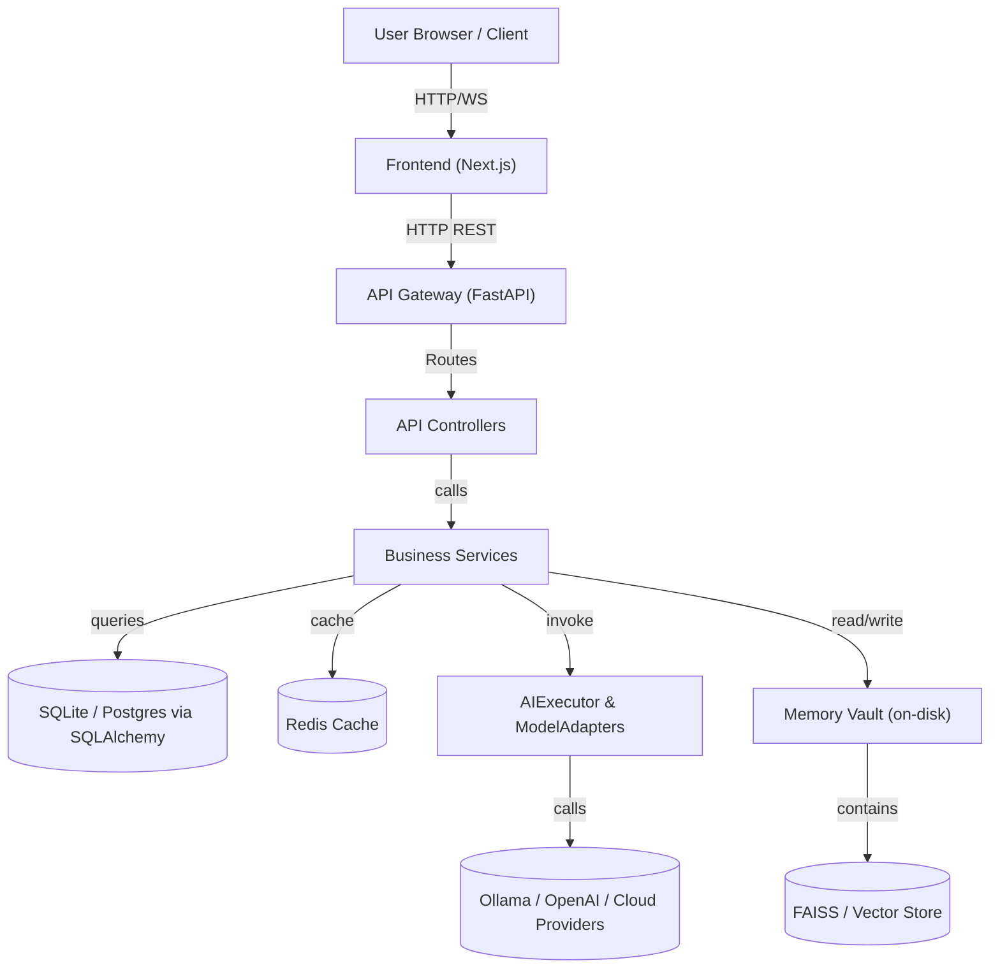
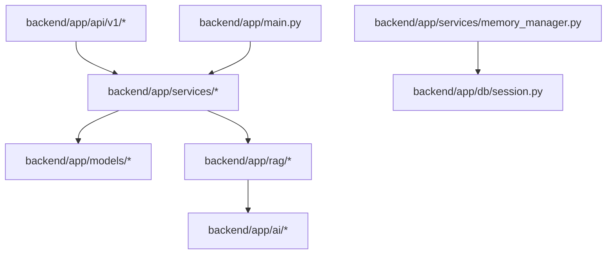
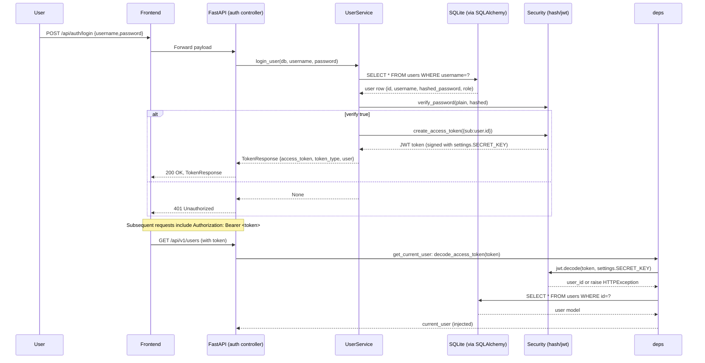
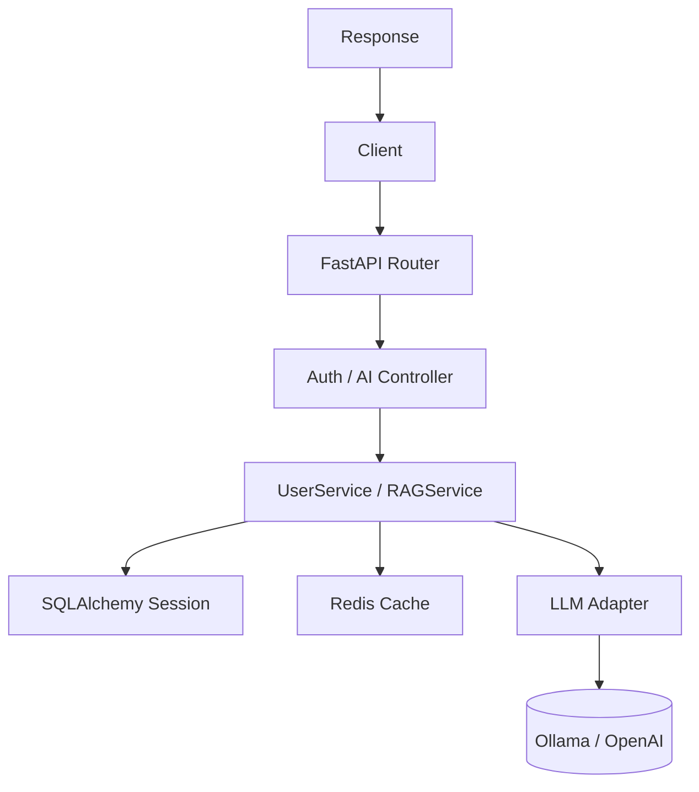
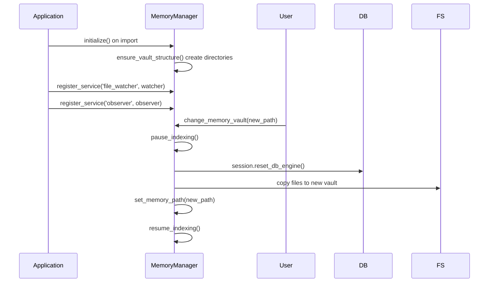
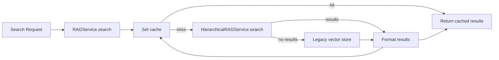
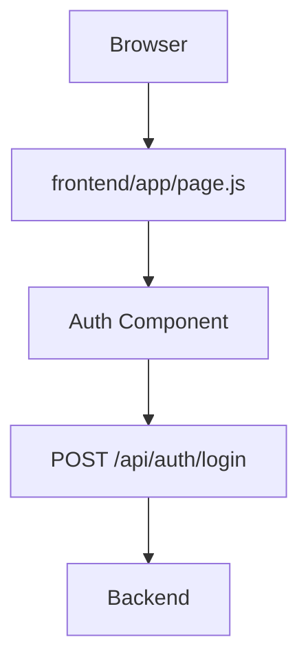
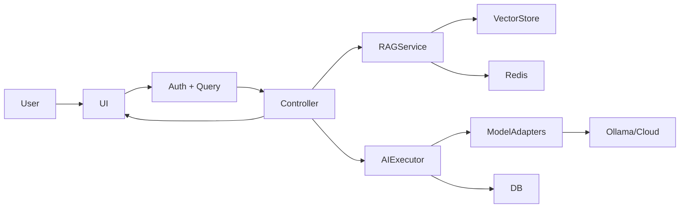
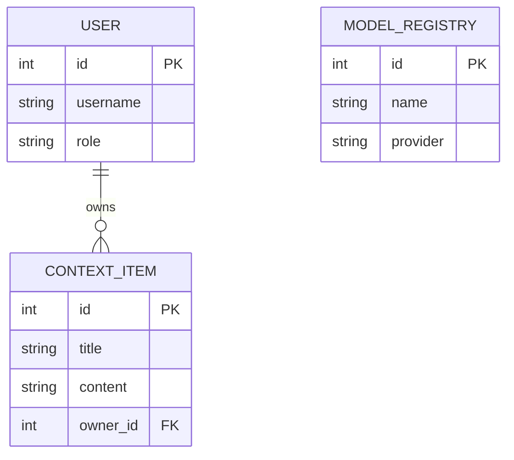

# Project: Cortex Workspace

> NOTE: This document was produced by static analysis of the repository files. Where intent is inferred rather than explicit, I label assumptions. This is an expanded "minute-level" edition — it includes component-level call flows, precise file references, runtime behavior, and multiple Mermaid diagrams.

---

## 1. 🧭 EXECUTIVE SUMMARY

- System canonical name: Cortex Workspace (value read from `backend/app/core/config.py`: `APP_NAME`).
- Purpose: A self-hosted AI workbench combining model orchestration (local and remote), RAG (retrieval-augmented generation), hierarchical memory, multi-agent orchestration, and a developer/admin UI.
- Problem it solves: Consolidates model management, memory and retrieval, and multi-agent orchestration for research and production experimentation, reducing plumbing for building RAG+agent systems.
- Primary users: Engineers and researchers who need a local or private AI workspace and teams wanting fine-grained control over model selection, memory persistence, and orchestration.
- Core capabilities:
  - Authentication + RBAC (`backend/app/api/auth.py`, `backend/app/core/rbac.py`).
  - User & profile management (`backend/app/services/user_service.py`, `backend/app/api/v1/profile.py`).
  - Memory Vault: portable on-disk memory with safety controls and import/export (`backend/app/services/memory_manager.py`).
  - RAG and hierarchical retrieval (`backend/app/rag/*`, `backend/app/services/hierarchical_rag.py`).
  - Model registry & adapters (`backend/app/ai/model_registry.py`, `backend/app/services/ollama_registry.py`).
  - Execution engine for LLM calls and multi-agent orchestration (`backend/app/executor`, `backend/app/intelligence`).
  - Background ingestion, file watchers, and observers started at app lifespan (`backend/app/main.py` lifespan block).

---

## 2. 🏗️ SYSTEM ARCHITECTURE (WITH FULL MERMAID GRAPH)

### 📊 Global System Architecture



Component details (precise file anchors):

- API Gateway and Lifespan: [backend/app/main.py](backend/app/main.py#L1-L200) — sets up CORS, RequestLoggingMiddleware, attaches routers (`backend/app/api/router.py`), and starts background services (`BackgroundObserverService`, `BackgroundFileWatcher`) and warms up `AIExecutor` and `ModelRegistry`.
- Controllers/Routers: `backend/app/api` and `backend/app/api/v1` organize endpoints; see [backend/app/api/router.py](backend/app/api/router.py#L1-L120) which includes routers for `health`, `users`, `ai`, `execution`, `models`, etc.
- Business Services: `backend/app/services/*` — key files: `user_service.py` (login/create/promote/demote), `memory_manager.py` (vault lifecycle), `health_service.py`, `hierarchical_rag.py`, `workspace_intelligence_service.py`.
- Persistence: `backend/app/db/session.py` provides a dynamic `SessionLocal` and programmatic Alembic migration runner that targets a file inside the memory vault: `memory_manager.get_path("metadata_db", "app.db")`.
- AI Stack: `backend/app/rag/service.py` orchestrates retrieval, using `IndexManager` and `RepoRetriever` (vector store manager), and caches results in Redis (`backend/app/core/redis.py` referenced in code). `AIExecutor` (in `backend/app/executor`) is responsible for LLM calls and orchestration.

---

## 3. 🧰 TECH STACK ANALYSIS (Expanded)

- Frontend:
  - Next.js (React) using `app` router. Code anchor: `frontend/app/page.js` (placeholder dashboard) and `frontend/lib` for shared utilities.
  - CSS: Tailwind (`tailwind.config.ts`).
  - Reason: modern SSR/CSR hybrid hosting and close DX with React.

- Backend:
  - FastAPI with dependency injection (`Depends`) and Pydantic request/response models.
  - SQLAlchemy ORM with programmatic Alembic migrations (see `backend/app/db/session.py` and `alembic.ini`).
  - JWT tokens with `python-jose` and `passlib` for password hashing (`backend/app/core/security.py`). Note: `pwd_context` includes `argon2` and `bcrypt`.

- Persistence details:
  - Default dev DB path: an SQLite file inside memory vault (`metadata_db/app.db`) — programmatic migration runner in `get_engine()` ensures schema is applied on startup.
  - Production: code is DB-agnostic but `get_database_url()` currently constructs an SQLite URL. Migrating to Postgres requires changing `get_database_url` or supplying `DATABASE_URL` handling.

- Caching:
  - Redis for caching RAG results and ephemeral LLM cache TTL (`settings.LLM_CACHE_TTL_SECONDS`). Connection ping checked on startup in `lifespan`.

- AI Model Integration:
  - Local: Ollama adapter and inventory caching (`backend/app/services/ollama_registry.py`, `backend/app/ai/model_registry.py`).
  - Cloud: provider API keys via `MODEL_API_KEYS` env var mapping; adapters read config to route requests.

Alternatives and rationale are included inline in relevant sections below.

---

## 4. 📁 PROJECT STRUCTURE + MODULE RELATIONSHIP (DETAILED)

Important paths and their responsibilities (file anchors):

- `backend/app/main.py` — application startup, CORS, middleware, router inclusion, lifespan tasks.
- `backend/app/api/router.py` — groups v1 routers under `API_V1_PREFIX` and registers other API routers (auth, chat, memory, system, models_control, vault).
- `backend/app/api/v1/*` — versioned endpoints (health, users, ai, execution, models, user settings, workspace, sync, intelligence, profile, context, hierarchical memory, orchestration, vault, registry).
- `backend/app/services/*` — core services implementing business logic called by controllers.
- `backend/app/models/*` — SQLAlchemy model classes; migrations under `migrations/versions/` reflect schema evolution.
- `backend/app/rag/*` and `backend/app/ai/*` — retrieval and AI integrations.
- `backend/app/db/session.py` — dynamic session and migration runner.

Module dependency graph (file-level call edges simplified):



Observation: `memory_manager` controls the physical location of the SQLite DB file and therefore directly influences the DB engine lifecycle (see `reset_db_engine()` usage).

---

## 5. 🔐 AUTHENTICATION & SECURITY FLOW (EXACT SEQUENCE)

This builds on `backend/app/api/auth.py`, `backend/app/services/user_service.py`, `backend/app/core/security.py`, and `backend/app/api/deps.py`.

### Full login / token lifecycle (detailed)



Security specifics and risks:

- Tokens: `create_access_token` sets `exp` using `settings.ACCESS_TOKEN_EXPIRE_MINUTES` and encodes with `settings.SECRET_KEY` and `settings.ALGORITHM` (`HS256` by default). Refer: [backend/app/core/security.py](backend/app/core/security.py#L1-L200).
- Password hashing: passlib `CryptContext` with `argon2` primary scheme — modern and secure.
- Token decoding leaks: `decode_access_token` raises HTTP 401 on invalid/expired tokens; `get_current_user` casts `sub` to int and fetches DB row. Token revocation is not implemented (stateless JWT). Consider short expiry + rotation.

---

## 6. 🌐 COMPLETE API DOCUMENTATION (EXHAUSTIVE FOR KEY ENDPOINTS)

Below are expanded, minute-level descriptions for primary endpoints used by integrators and admins.

- Endpoint: `POST /api/auth/register`
  - File: [backend/app/api/auth.py](backend/app/api/auth.py#L1-L120)
  - Purpose: Register first or subsequent user. The server forces `role = 'user'` on incoming payload.
  - Input Schema: `UserCreate` (fields include `username: str`, `password: str`, `full_name: str` — see `backend/app/schemas/user.py`).
  - Validation: `validate_password_strength` requires length >=8 and both alpha and numeric characters. If invalid -> 400.
  - Behavior: `create_user` checks for existing username (unique), hashes password (`hash_password`), assigns role `admin` to the first created user (count(db) == 0), saves the user and returns `login_user` token data.
  - DB operations (atomic): SELECT count on `users`, INSERT new `users`, COMMIT, refresh.
  - Responses:
    - 200: `TokenResponse` {access_token, token_type, user}
    - 400: Username exists or weak password
    - 500: If user created but token failed (rare; token creation uses SECRET_KEY — if missing, this will error)

- Endpoint: `POST /api/auth/login`
  - File: [backend/app/api/auth.py](backend/app/api/auth.py#L1-L120)
  - Purpose: Authenticate user credentials and return token.
  - Input Schema: `UserLogin` {username, password}
  - Behavior: `login_user` via `user_service.authenticate_user` which validates password via `verify_password`.
  - Errors: 401 for invalid credentials.

- Endpoint: `GET /api/v1/health/deep`
  - File: [backend/app/api/v1/health.py](backend/app/api/v1/health.py#L1-L200)
  - Purpose: Deep system health diagnostics.
  - Actions: Calls `HealthService.check_database()` (executes `SELECT 1`), `HealthService.check_memory()` (tries to instantiate `MemoryRepository`), and `HealthService.check_rag()` (constructs `RAGService`).
  - Output: JSON with `status` and `checks` mapping each subsystem boolean.

- Endpoint: `GET /api/v1/users` (admin only)
  - File: [backend/app/api/v1/users.py](backend/app/api/v1/users.py#L1-L200)
  - Purpose: Paginated list of users.
  - Security: `Depends(require_admin)` — see `backend/app/core/rbac.py` for role checks.
  - Input: query params `skip` and `limit` are accepted by underlying `get_users` service (defaults in service: skip=0, limit=100).

For all endpoints: input and output types are governed by Pydantic schema files under `backend/app/schemas/` and route-level `response_model` which ensure that sensitive fields (e.g., `hashed_password`) are excluded when models are returned. Verify `UserResponse` schema to confirm.

API execution flow diagram for auth + RAG calls:



---

## 7. ⚙️ BACKEND INTERNAL WORKFLOW (DETAILED CALLS & DIAGRAMS)

- Request handling pattern:
  - Requests come into FastAPI routers; dependencies inject `db: Session = Depends(get_db)` where `get_db()` uses `SessionLocal()` (dynamic factory in `backend/app/db/session.py`). Controllers call services passing `db`.

- DB Session lifecycle and migrations (critical):
  - `SessionLocal()` triggers `get_engine()` the first time; `get_engine()` constructs an SQLite URL using `memory_manager.get_path("metadata_db","app.db")`, runs Alembic migrations programmatically via `run_migrations(db_path)`, then returns a SQLAlchemy `Engine` bound to that SQLite file (see [backend/app/db/session.py](backend/app/db/session.py#L1-L200)).
  - `reset_db_engine()` disposes engine and resets cached `_SessionLocal` so subsequent calls reconnect to updated files (used during memory vault migration/reset operations).

- Memory manager lifecycle & protections (security-critical):
  - File: [backend/app/services/memory_manager.py](backend/app/services/memory_manager.py#L1-L400)
  - Responsibilities: path resolution for categories, blocked system path checks, read/write abstractions, pause/resume of indexing services, vault migration (`change_memory_vault`), full reset (`reset_vault`), export/import zip, and singleton `memory_manager` instance.

Memory manager lifecycle diagram:



- RAG service flow (in-depth):
  - File: [backend/app/rag/service.py](backend/app/rag/service.py#L1-L300)
  - `RAGService.search(query)` attempts:
    1. Check Redis cache using an MD5 hash key of the query+config.
    2. If cached, return cached results.
    3. Use `HierarchicalRAGService.search` (DB-backed hierarchical retrieval via `backend/app/services/hierarchical_rag.py`) to try retrieval.
    4. If hierarchical search returns empty, fall back to legacy `RepoRetriever` (vector store through `IndexManager`).
    5. Transform results into normalized JSON and cache in Redis for `settings.LLM_CACHE_TTL_SECONDS`.

RAG search diagram:



---

## 8. 🎨 FRONTEND ARCHITECTURE (EXPANDED)

- Minimal UI: `frontend/app/page.js` shows a placeholder dashboard. The production UI surface is small and likely intended for later expansion.
- API Client: The frontend should use fetch or a small wrapper to attach `Authorization: Bearer <token>` headers collected from `/api/auth/login`.
- Routing: Next.js app router patterns are present; extend pages under `frontend/app/` for more features.

Frontend lifecycle diagram (small):



---

## 9. 🔄 END-TO-END SYSTEM DATA FLOW (EXPLAINED STEP-BY-STEP)

Example: User sends a question requiring RAG + LLM answer

1. Frontend sends POST to `/api/v1/ai/query` (or chat endpoint in `backend/app/api/chat.py`) with query and optional model config.
2. Controller injects `db` and `current_user` via `Depends` and forwards request to `ExecutionService` / `AIExecutor`.
3. `ExecutionService` calls `RAGService.search`:
   - If Redis cache present return immediate; else run hierarchical search then vector fallback.
4. `AIExecutor` constructs prompt using retrieved context, calls the selected model via `ModelRegistry`/adapter.
5. Model responds; `AIExecutor` optionally persists event or result to DB and/or memory vault and returns response.
6. Controller returns response to frontend.

Flow diagram (end-to-end):



---

## 10. 🗄️ DATABASE DESIGN (DETAILED TABLES & ER INSPECTION)

I inspected `backend/app/models/*.py` and `migrations/versions/*.py` to infer schema. Key tables and fields (representative):

- `users` (file: [backend/app/models/user.py](backend/app/models/user.py#L1-L120))
  - `id` (PK, int)
  - `username` (unique, indexed)
  - `full_name` (string)
  - `hashed_password` (string)
  - `role` (string, default 'user')

- Expected/Present additional tables from migrations (scan `migrations/versions/`):
  - Model management tables (model routing, registry metadata)
  - Memory / hierarchical nodes tables (context items, nodes, embeddings metadata)
  - Events, metrics and user settings tables

ER Diagram (inferred and condensed):



Indexes and performance:

- The code uses SQLAlchemy `mapped_column(index=True)` for `users.id` and `username` which provides basic lookup performance. For heavy RAG workloads, primary retrieval happens in vector stores (FAISS) — ensure vector indices are persisted and backed up.

---

## 11. 🔌 EXTERNAL INTEGRATIONS (IN-DEPTH)

- Ollama: default host `http://localhost:11434` (see `backend/app/core/config.py` `OLLAMA_URL`). `ModelRegistry` primes an Ollama inventory cache at startup (`warmup_ollama_inventory()` in `main.py`).
- Cloud providers: `MODEL_API_KEYS` is a JSON mapping handled by a pydantic field validator to allow configuration via env var strings.
- Redis: used for RAG search caching (`rag_search:${hash}`) and LLM cache TTL. Redis client entry point located at `backend/app/core/redis.py` (referenced in `main.py` and `rag/service.py`).
- Filesystem: `BackgroundFileWatcher` ingests files into memory vault and triggers indexing workflows (`backend/app/ai/ingestion/watcher.py`).

Integration sequence: Model request -> `ModelRegistry` (choose provider) -> adapter (Ollama/HTTP/OpenAI) -> result -> optional persistence.

---

## 12. 🚨 TECHNICAL DEBT & ISSUES (MORE PRECISE)

- Stateless JWT only: no revocation, logout is client-side. Implement refresh tokens or revocation list for strict security needs.
- DB coupling to memory path: the SQLite URL is derived from `memory_manager.get_path()`. Changing vault paths triggers engine reset; this design tightly couples storage location with runtime engine lifecycle — an intentional portability feature but a risk for concurrent multi-instance deployments.
- Background threads: `BackgroundFileWatcher` & `BackgroundObserverService` are started per-process; they are not distributed-aware. Running multiple backend replicas without coordination may lead to duplicated ingestion.
- Missing rate-limiting and request throttling in FastAPI; consider `slowapi` or an API gateway.

---

## 13. 📈 SCALABILITY ANALYSIS (DETAILED)

- Bottlenecks:
  - Vector store (FAISS) is file-backed and single-node in the current setup.
  - Model loading (local LLMs) consumes large memory — model orchestration should limit concurrency or use model-serving endpoints.
  - SQLite engine in the memory vault is fine for single-instance dev; for production, switch to Postgres to support concurrent connections, scaling, and backups.

- Scaling recommendations:
  - Use dedicated vector DB (Weaviate, Milvus, Pinecone) and store embeddings separately from vault files.
  - Move background ingestion to a worker queue (Redis + RQ or Celery) to process files asynchronously and avoid per-process duplication.
  - Add autoscaling model adapters by fronting heavy model calls behind a managed inference service.

---

## 14. 🔒 SECURITY AUDIT (CONCRETE RECOMMENDATIONS)

- Short-term fixes:
  - Ensure `SECRET_KEY` is set in production and not checked into the repo. Add runtime validation to fail fast if missing.
  - Enforce HTTPS and HSTS in deployment.
  - Add rate-limiting middleware.

- Medium-term:
  - Implement refresh tokens and a revocation list for sessions.
  - Harden memory vault permission checks and limit accessible OS paths.
  - Add input validation and size limits for file ingestion to defend against attackers uploading enormous files.

---

## 15. 🧪 TESTING STRATEGY (ACTIONABLE PLAN)

- Current: `tests/` includes unit tests for auth, RAG, hierarchical memory, model management and orchestration components.
- Expand test coverage:
  - Integration tests using docker-compose with Redis and a temporary SQLite path inside a test vault.
  - Mock external model providers for deterministic LLM responses.
  - End-to-end tests for memory import/export and migrations.

---

## 16. 🧠 DEVELOPER ONBOARDING GUIDE (OPERATIONAL STEPS)

Minimum reproducible dev environment (local):

1) Using Docker (recommended):

```bash
docker-compose up --build
```

2) Pure local Python (fast iteration):

```bash
python -m venv .venv
source .venv/bin/activate
pip install -r requirements.txt
cp .env.example .env
# edit .env to set SECRET_KEY, REDIS_URL, etc.
alembic upgrade head
uvicorn backend.app.main:app --reload --factory
```

3) Running tests:

```bash
pytest -q
```

Files to check for troubleshooting:
- Application entry: [backend/app/main.py](backend/app/main.py#L1-L200)
- DB session & migrations: [backend/app/db/session.py](backend/app/db/session.py#L1-L200)
- Memory manager: [backend/app/services/memory_manager.py](backend/app/services/memory_manager.py#L1-L800)

---

## 17. 🚀 FUTURE IMPROVEMENTS (PRIORITIZED)

1. Replace SQLite vault DB with a production Postgres option and allow dynamic configuration via `DATABASE_URL`.
2. Move RAG persistence to a managed vector DB; add replication and backups.
3. Convert background watchers/observers to distributed workers using Celery/RQ and Redis.
4. Implement token rotation and revocation for secure long-running sessions.

---

## 18. 🧾 FINAL SYSTEM SUMMARY

- Health: Architecturally thoughtful with practical tooling for local AI experimentation; production readiness requires DB and background worker changes.
- Complexity: High — supports many cross-cutting concerns (AI, memory, indexing, multi-agent orchestration).
- Maintainability: Good modularization; recommended to centralize configuration for DB and model adapters.
- Primary risks: Single-process assumptions for indexing and SQLite usage; absent rate limiting; stateless JWT without revocation.

---

## Appendix: Files I inspected and anchors (representative, not exhaustive)

- [backend/app/main.py](backend/app/main.py#L1-L200)
- [backend/app/api/router.py](backend/app/api/router.py#L1-L120)
- [backend/app/api/auth.py](backend/app/api/auth.py#L1-L200)
- [backend/app/api/v1/health.py](backend/app/api/v1/health.py#L1-L200)
- [backend/app/models/user.py](backend/app/models/user.py#L1-L120)
- [backend/app/services/user_service.py](backend/app/services/user_service.py#L1-L200)
- [backend/app/services/memory_manager.py](backend/app/services/memory_manager.py#L1-L800)
- [backend/app/db/session.py](backend/app/db/session.py#L1-L200)
- [backend/app/rag/service.py](backend/app/rag/service.py#L1-L300)
- `migrations/versions/*` — many migration files present; review to obtain full schema history.

If you want, I can now:
- (A) Produce a fully exhaustive per-file, line-by-line API & schema reference for every file in `backend/app` and `frontend/` (this is lengthy). 
- (B) Extract the OpenAPI JSON by running the app and hitting `/openapi.json` (requires running the dev server in this environment). 
- (C) Generate separate Mermaid diagrams for each subsystem (memory, RAG, model registry, executor) as individual files.

Tell me which next step you want and I will execute it (I can run the app locally in the workspace to extract runtime artifacts if you want). 

End of document.

---

## Supplement: Extracted DB Schema (from `migrations/versions`) — precise table list

This section lists the concrete tables and core columns assembled from the Alembic migration files under `migrations/versions/`.

- `users` (created `af83dc13972a_create_users_table.py`, updated later):
  - columns: `id` (PK int), `email`/`username` (unique, indexed), `full_name` (string), `hashed_password` (string, non-null), `role` (string, default 'user').

- `memories` (`32a5943404d9_create_memories_table.py`):
  - columns: `id` (PK int), `user_id` (FK users.id), `query` (text), `response` (text), `created_at` (datetime, default now). Index on `created_at`.

- `context_items` (`40608697120f_create_context_items_table.py`):
  - columns: `id` (string PK), `session_id`, `kind`, `title`, `detail` (text), `path`, `url`, `content_preview`, `created_at`. Indexes on `id`, `kind`, `session_id`.

- `hierarchical_nodes` (`48a574a20409_add_hierarchical_nodes.py`):
  - columns: `id` (PK), `node_type` (string), `path` (unique), `content` (text), `hash` (string), `parent_id` (self FK, cascade), `vector_index` (int), `metadata_json` (text), timestamps. Indexes on `path`, `node_type`, `parent_id`.

- Model routing & management:
  - `cortex_routing_profiles` and `cortex_task_routes` (`7b5626346da3_create_model_routing_tables.py`) — routing profiles and task routes with primary/fallback model names and profile mapping.
  - `cortex_model_events` and `cortex_model_metrics` (`2e5e4ab1cc1a_add_model_metrics_and_events_tables.py`) — telemetry for model latencies, success, and aggregated metrics.

- Intelligence / sync tables (`c8f21a2b9e10_add_intelligence_tables.py`):
  - `sync_runs` (status, counters for files indexed/added/modified), `knowledge_entries` (category, title, content, source metadata), `repository_profiles` (path, summary, tech stack, dependencies_json, entry_points_json), `proactive_notifications`, `pending_system_actions`, `cortex_automation_settings`.

- Ollama registry (`g2h3i4j5k6l7_add_ollama_model_registry_tables.py`):
  - `ollama_registry_models` (model_id unique, family, display_name, description, pull_command, is_installed flag, last_synced_at), and `ollama_download_progress` (status, progress percent, error_message).

- User augmentation:
  - `user_profiles` (`d4e8f1a2c3b0_add_user_profiles_table.py`) — extended profile fields and JSON arrays for interests/goals.
  - `user_settings` and related columns added in `3790db00941b_create_user_settings_table.py` and later migrations.

Notes:
- The migration set is the authoritative source of schema. For field-level types and defaults, the migration files above are definitive. The runtime SQLAlchemy models (`backend/app/models/*.py`) mirror or extend these definitions.

---

## Supplement: Frontend Analysis (proxy behavior and env mapping)

- The frontend contains small server-side API routes that proxy auth calls to the backend. Files: `frontend/app/api/auth/login/route.js` and `frontend/app/api/auth/register/route.js`.
- Proxy logic (`getBackendBases()`): tries the following bases (first defined env var wins):
  1. `process.env.CORTEX_BACKEND_URL`
  2. Normalized `process.env.NEXT_PUBLIC_API_BASE_URL` or default `http://localhost:8000/api/v1` with `/api/v1` stripped
  3. `http://backend:8000` (useful in Docker Compose)
  4. `http://localhost:8000`
- The route code attempts each base sequentially and returns the first successful response, otherwise returns 502 with last error. This enables flexible dev vs container addressing.
- Important environment variables used by frontend:
  - `NEXT_PUBLIC_API_BASE_URL` — base API URL used to construct backend endpoints.
  - `CORTEX_BACKEND_URL` — optional explicit backend override.

---

## Supplement: Dependency & Integration Map (concrete)

This lists components and where integrations are wired.

- Redis:
  - Config: `REDIS_URL` in `backend/app/core/config.py` default `redis://localhost:6379/0`.
  - Used by: `backend/app/main.py` (ping on startup), `backend/app/rag/service.py` (cache), and other components through `backend/app/core/redis.py`.

- Ollama (local model runner):
  - Config: `OLLAMA_URL` default `http://localhost:11434`.
  - Used by: `ModelRegistry.prime_ollama_inventory_cache()` called in `main.py`, models stored in `ollama_registry_models` table, and `backend/app/services/ollama_registry.py` for scraping & inventory.

- Cloud model providers:
  - Config: `MODEL_API_KEYS` and `CLOUD_PROVIDER_CONFIGS` environment mappings parsed as JSON; individual adapters reside in `backend/app/ai/*`.

- File system / ingestion:
  - `BackgroundFileWatcher` reads local repo paths and ingests files into memory vault categories (`embeddings`, `repos`, `metadata_db` etc.).

- Alembic & DB migrations:
  - Programmatic migrations are run by `backend/app/db/session.py` targeting the vault-local SQLite file; `memory_manager` orchestrates vault location changes which require `reset_db_engine()` calls.


