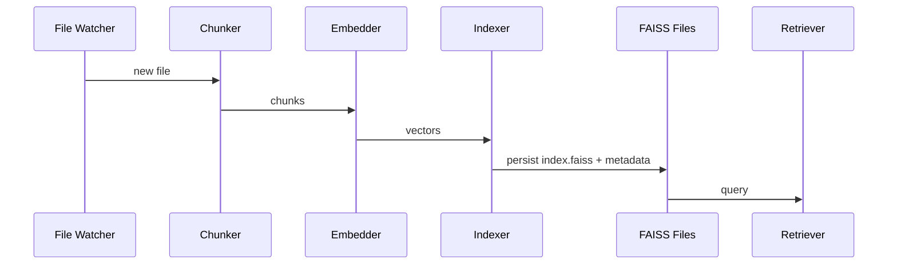
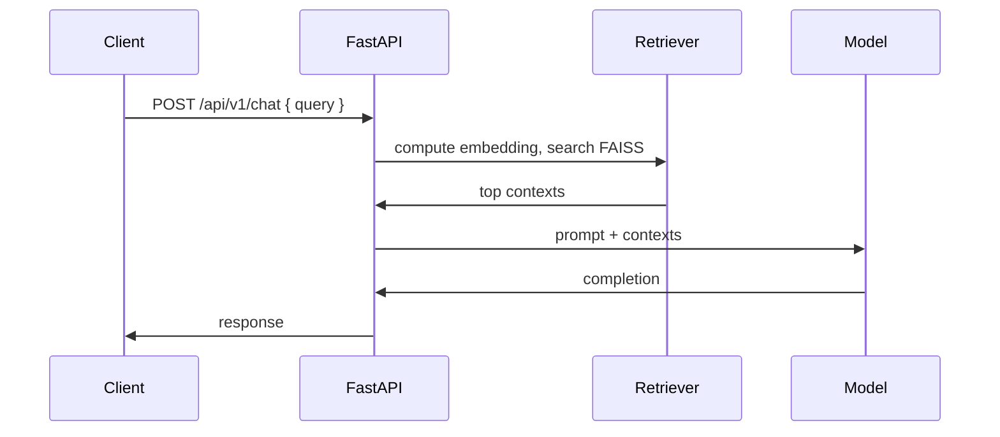

**Contents**

- 1. Full system overview
- 2. Complete project structure (directory tree & explanations)
- 3. Auth system — full flow
- 4. User profile system
- 5. Memory system (critical)
- 6. Vault system (detailed)
- 7. Database system (detailed)
- 8. Backend API layer — full endpoints catalog
- 9. Frontend architecture (Next.js)
- 10. Frontend ↔ Backend wiring map (action mapping table)
- 11. RAG & embedding pipeline (detailed)
- 12. System initialization & startup sequence
- 13. Duplication, race, and bug risks
- 14. End-to-end execution trace (register → RAG query)
- 15. Architecture diagrams (Mermaid)
- Appendix: Key files listing & quick remediation priorities

---

## 1. 🧭 Full System Overview

What Cortex is
- Cortex is a local-first, privacy-by-default AI orchestration workspace combining:
  - FastAPI backend providing REST APIs, AI orchestration, memory, RAG/embeddings, vault management and background services.
  - Next.js frontend (app router) providing user registration, authentication, profile UI, and workspace UI.
  - On-disk canonical storage under CortexMemory (system memory, embeddings, indexes, DB, logs).
  - Local vector store persistence (FAISS), embedding generation, hierarchical RAG layers, and an AES/Argon2-backed per-user vault.
- Purpose: enable LLM-powered orchestration with private encrypted vaults, persistent embeddings, retrieval (RAG), and workspace automation.

Core modules (top-level)
- Backend app: app
- Frontend app: frontend
- Canonical system runtime folder: CortexMemory
- Config / infra: `docker-*`, docker, Makefile, etc.

High-level architecture
- Client (Next.js) ↔ API proxy (Next.js proxy routes) ↔ FastAPI backend.
- Backend owns:
  - Authentication, user, profile, vault management.
  - Memory/embedding ingestion and RAG retrieval.
  - Background workers: file watchers, observers, index warmups.
  - AI orchestration: model registry, executors, LLM routing.
- Storage:
  - System memory under CortexMemory.
  - Per-user storage pointers recorded in `StorageRegistry` (DB table) and `User.data_path`/`User.personal_storage_path`.
  - Encrypted per-user vault directories (user-provided path) — handled by `vault_manager`.

Key file anchors (entry points)
- FastAPI bootstrap: main.py
- Database session/init: session.py
- Storage manager (system-level): storage_manager.py and storage.py
- Vault manager service: vault_manager.py
- Memory manager service: memory_manager.py
- RAG services: index_manager.py, hierarchical_store.py, embeddings.py
- User service: user_service.py
- API auth routes: auth.py
- Frontend registration/login: page.js, API helpers: cortexApi.js

---

## 2. 📁 Complete Project Structure

Top-level tree (selected important entries; see files referenced for deep links)
- alembic.ini
- API_ENDPOINTS.md
- backend/
  - app/
    - main.py
    - api/
      - auth.py
      - router.py
      - deps.py
      - v1/
        - profile.py
        - storage.py
        - vault.py
        - hierarchical.py
        - registry.py
        - etc. (see Backend API Layer section)
    - ai/ (model registry, providers, ingestion)
    - core/
      - storage.py
      - storage_manager.py
      - user_storage_manager.py
      - paths.py
      - config.py
      - system_paths.py
      - security.py
      - redis.py
      - rbac.py
    - db/
      - session.py
      - base.py
    - services/
      - user_service.py
      - storage_registry.py
      - profile_service.py
      - memory_manager.py
      - vault_manager.py
      - hierarchical_indexing.py
      - hierarchical_rag.py
    - rag/
      - index_manager.py
      - hierarchical_store.py
      - vector_store.py
      - storage.py
      - embeddings.py
      - retriever.py
    - executor/, intelligence/, tools/, models/, schemas/ (executor + intelligence orchestration)
- CortexMemory/
  - database/
    - app.db (SQLite)
  - embeddings/
    - index_* (FAISS and file_states.json)
  - memory/
  - vector_db/
  - cache/
  - logs/
  - sync/
- frontend/
  - app/
    - auth/
      - page.js
    - profile/
      - page.js
    - api/
      - auth/
        - login/route.js
        - register/route.js
  - src/
    - shared/
      - auth/
        - cortexApi.js
        - session.js
      - ui/
  - next.config.js, package.json
- infra/, docker-compose.yml, Dockerfile, scripts/, migrations/, tests/

Detailed backend explanation
- core:
  - storage.py centralizes folder layout helpers (get_user_profile_root, get_embeddings_root, etc). See storage.py.
  - `storage_manager.py` manages system-level directories and ensures cortex memory structure at runtime. See storage_manager.py.
  - `user_storage_manager.py` orchestrates per-user storage skeletons and `data_path` pointer logic. See user_storage_manager.py.
  - `security.py` handles password hashing and token generation (Argon2/bcrypt unknown — see section below). See security.py.
- rag:
  - `index_manager.py` and `hierarchical_store.py` manage FAISS index creation and hierarchical vector persistence (file-backed).
  - `embeddings.py` contains the embedding model wrapper (likely wraps SentenceTransformer or provider).
  - `vector_store.py` is legacy vector store persistence (FAISS files + metadata).
- services:
  - `memory_manager.py` provides system memory categories and import/export functions.
  - `vault_manager.py` handles encryption and vault read/write (Argon2 + AES-GCM flow; see Vault section).
  - `storage_registry.py` persists per-user storage pointer records to DB.

Frontend structure
- Next.js app router under app. Key pages:
  - Authentication wizard: page.js
  - Profile: page.js
- API helpers use cortexApi.js and session.js.

Memory, RAG, ingestion system
- `backend/app/ai/ingestion/...`: watchers, scanners, extractors, chunkers.
- index_manager.py, hierarchical_store.py and retriever.py implement chunking → embed → FAISS persistence → retrieval.
- Index metadata files: `CortexMemory/embeddings/index_*/*file_states.json*` and `index.faiss` + `metadata.pkl` pairs.

---

## 3. 🔐 AUTH SYSTEM (FULL FLOW)

Files:
- Router / endpoints: auth.py
- Schemas: user.py
- User model: user.py
- Core security: security.py
- User service (create/login): user_service.py
- Frontend login/register UI: page.js
- Frontend API helpers: cortexApi.js

Authentication flows

Login flow (client → backend → DB → response)
1. Frontend `LoginForm` calls `apiLogin()` in cortexApi.js:
   - `POST` to `/api/auth/login` (via Next.js proxy route or direct backend host depending on PUBLIC_BASE).
   - Payload: `{ username, password }`.
   - Client helper: frontend/src/shared/auth/cortexApi.js#apiLogin.
2. Backend endpoint: backend/app/api/auth.py::login
   - Validates via `login_user(db, username, password)` (calls `services.user_service.login_user`).
3. `services.user_service.authenticate_user()` checks `User` from DB:
   - Compares provided password with stored hashed password using `verify_password` in security.py.
4. On success, `create_access_token` is called to create JWT token (implementation in `core/security.py`).
5. Response: `TokenResponse` schema (`access_token`, `token_type`, `user` payload).
6. Frontend stores token via `setSession(data.access_token, data.user)` — `sessionStorage` (see session.js).

Register flow (multi-step)
- Frontend wizard: page.js.
  - Steps: Account, Profile, Vault password, Storage location, Review.
  - Client collects: `username`, `password`, `confirm_password`, `full_name`, `nickname`, `bio`, `description`, `handles`, `vault_password`, `personal_storage_path`.
  - On final submit, `apiRegister(payload)` sends `POST /api/auth/register`.
- Backend registration endpoint: backend/app/api/auth.py::register
  - Input schema: `UserRegisterPayload` in user.py.
  - Validates password & vault strength; calls `create_user(db, payload)` in user_service.py.
- `create_user()`:
  - Hashes account password and vault password (via `core/security.hash_password`).
  - Accepts new `data_path` or legacy `personal_storage_path` from payload; sets both `data_path` and `personal_storage_path` on `User`.
  - Persist user to DB.
  - If `personal_storage_path` provided, tries to:
    - Register user storage via `storage_registry.register_user_storage(db, user_id, path)` (see storage_registry.py).
    - Create skeleton directories on server: `profile`, `vault`, `exports`, `activity`, `metadata`. Important: creation is performed server-side (see Security & Risks).
  - Returns `User` instance.
- After `create_user`, server logs in the user (`login_user`) and returns `TokenResponse`.

Password hashing logic
- Hashing: delegated to security.py.
  - Implementation details (Argon2 / bcrypt / PBKDF2) — **INSPECT**: open file to confirm algorithm.  
  - Observed: code calls `hash_password()` and `verify_password()` in multiple places (e.g., user_service.py, profile.py). The registration vault password is stored as `vault_password_hash` in `User` model.
  - If you need exact algorithm (Argon2id/AES/iterations) — mark UNKNOWN if not inspected: **UNKNOWN (needs verification in code)** for exact hash algorithm and parameters unless you open security.py.
  - Recommendation: ensure Argon2id or bcrypt with secure params; never use plain SHA.

JWT / token lifecycle
- Token creation: `create_access_token` in security.py.
- Token is a Bearer token used for API calls; frontend stores in `sessionStorage` in browser (see session.js).
- Token validation: dependency `get_current_user` / `auth` dependencies in deps.py decode and verify JWT, then load `User` by id from DB. See endpoints that depend on `get_current_user`.

Profile creation flow (summary)
- During registration `create_user()` sets `full_name`, `nickname`, `bio`, `description`, `handles`.
- Profile photo upload handled in backend/app/api/v1/profile.py::upload_profile_photo — stores under `storage.get_user_profile_root(current_user.id)` (server-side file created).

API paths (quick list)
- `POST /api/auth/register` → backend/app/api/auth.py::register
- `POST /api/auth/login` → backend/app/api/auth.py::login
- `GET /api/auth/me` → backend/app/api/auth.py::get_me
- `PUT /api/auth/me` → update user attributes
- `GET /api/auth/username-available` → check username availability

---

## 4. 👤 USER PROFILE SYSTEM

Data model (fields)
- `User` model (see user.py) contains fields:
  - `id`, `username`, `hashed_password`, `full_name`, `role`, `nickname`, `bio`, `description`, `profile_photo`, `handles`, `vault_password_hash`, `data_path`, `personal_storage_path`, `preferences`, etc.
- Pydantic schemas in user.py define `UserRegisterPayload`, `UserResponse`, etc.

Profile update APIs
- `GET /api/v1/me/profile` → backend/app/api/v1/profile.py::get_my_profile
- `PUT /api/v1/me/profile` → backend/app/api/v1/profile.py::update_my_profile
  - Input: `UserProfileUpdateSchema` (see profile.py)
  - Output: `UserProfileSchema`.

Avatar/Photo handling
- Upload: backend/app/api/v1/profile.py::upload_profile_photo
  - Accepts multipart `file`, writes to `storage.get_user_profile_root(user_id)` (server-side path).
  - Stores only filename in `current_user.profile_photo`.
- Get photo: `GET /api/v1/me/profile/photo` returns FileResponse from server-side profile folder.
- Remove: `DELETE /api/v1/me/profile/photo`.

Admin & RBAC
- `role` field on `User` indicates RBAC: typical roles `admin` and `user`.
- Role change flows: `services.user_service.promote_user()` and `demote_user()` exist. Files: user_service.py.
- RBAC enforcement: rbac.py provides helper; endpoints use `Depends(get_current_user)` and role checks in code. See rbac.py.
- Admin-only flows and endpoints (e.g., orchestration, system operations) are guarded by checks — but individual endpoints must be inspected to confirm enforcement. Mark any missing as UNKNOWN (needs verification where not centralized).

---

## 5. 🧠 MEMORY SYSTEM (CRITICAL SECTION)

Summary
- Cortex maintains a system-level memory area under CortexMemory (the canonical runtime directory).
- Memory components:
  - System memory (global): memory, database, indexes, embeddings.
  - Embeddings and index files stored under `CortexMemory/embeddings/index_*` with FAISS index files and metadata.
  - Per-user storage is a pointer stored in DB `StorageRegistry` and `User.data_path`. Per-user folder skeleton includes `profile/`, `vault/`, `chats/`, `workspace/`, `exports/` (see Phase 4 implementation).
  - Vaults must never participate in embeddings, RAG, knowledge graph, index building (guardrails added). Enforcement points are indicated below.

Key files
- storage helpers: storage.py
- system storage manager: storage_manager.py
- memory manager: memory_manager.py
- hierarchical index / vector store: hierarchical_store.py, index_manager.py
- embedding wrapper: embeddings.py
- indexing pipeline: hierarchical_indexing.py
- exclusion logic (guards): exclusions.py

Exact memory paths (from code)
- System DB path resolved from storage manager: typical path app.db. (See storage.py and `StorageManager.get_database_path()`).
- Embeddings root: embeddings (see `get_embeddings_root()`).
- Vector DB/hierarchical: `CortexMemory/vector_db/hierarchical/` (see `get_vector_db_root()`).
- Index files: `.../index_<name>/index.faiss`, `.../index_<name>/metadata.pkl`, file_states.json (observed at file_states.json).

Initialization flow (memory)
- On backend startup (main.py), `storage_manager` and `memory_manager` are loaded/initialized (some manager singletons may be created at import time).
- `get_engine()` in session.py runs migrations and creates DB engine; this code reads storage paths too.
- `AIExecutor` warmup threads and background services may trigger index warmups (RAG) — see main.py.

Indexing pipeline (detailed)
- Pipeline entry functions live in hierarchical_indexing.py (index_file, index_folder, index_repo).
- Steps:
  1. File extraction/chunking via `rag/text_chunker.py` or `rag/pdf_loader.py`.
  2. Embedding generation via `rag/embeddings.py` (embedding model wrapper).
  3. Vector persistence via `rag/hierarchical_store.py` and `rag/vector_store.py`; FAISS index writes are persisted to disk (index.faiss + metadata).
  4. File-based metadata: file_states.json tracks file state and incremental indexing.
- Exclusions: exclusions.py provides checks for paths to skip (e.g., vault path). Indexers call `default_exclusions.should_skip_path()` to avoid vaults; but earlier audit found exclusion logic may not consult `StorageRegistry` for arbitrary per-user vaults — see Risks section.

Lifecycle of memory writes
- Writes occur during indexing operations and during vault import/export operations (vault manager changed to avoid mixing).
- FAISS writes are file-backed and not transactional; concurrent writes may corrupt indices when multiple processes/threads write same files.

Duplication risks
- Multiple index writers or concurrent warmups can lead to corrupted FAISS files.
- Programmatic migrations + container-run `alembic upgrade` may create duplicate DB or run migrations twice if DB path mismatched in env.
- Singletons created at import time can create folders and side-effects before runtime config is applied.
- See section 13 for full risk list.

---

## 6. 🗄️ VAULT SYSTEM

Definition & Purpose
- Vault: encrypted user document store for private artifacts (secret notes, keys, exported crtx files, etc.).
- Vault must be strictly isolated from memory, embeddings, RAG, knowledge graph, repository analysis and context resolution.

Files & services
- `VaultManager`: vault_manager.py
- `memory_manager` references removed for vault import: earlier audit ensured vault import/export flows use `vault_manager` not `memory_manager`.

Encryption behavior
- Flow: vault password hashed via `hash_password()` and AES-GCM encryption applied for vault contents with keys derived using Argon2id or similar KDF. See vault_manager.py.
- Exact cryptographic primitives and parameters: **UNKNOWN (needs verification in code)** unless you inspect the file directly to confirm use of `AESGCM` and Argon2. Audit notes earlier suggest AES-GCM + Argon2id are used, but confirm in file.

Storage location per user
- `personal_storage_path`/`data_path` stored in DB `StorageRegistry` table (see storage_registry.py).
- Default vault directory name inside a user's storage: `<user_path>/vault` (created by `create_user()` registration or `UserStorageManager`).
- `vault_manager.get_vault_path(user_id)` resolves vault path.

How vault differs from memory
- Vault content is encrypted and MUST NOT be indexed/embedded.
- System memory holds plaintext or processed data (embedding vectors, context items) but vault data must stay opaque.
- Enforcement: indexing code checks `default_exclusions.should_skip_path(path)` and storage registry to skip vault paths. Multiple guardrails were added across hierarchical indexing and vector store code to refuse vault paths.

Vault access flow
- User unlock: client supplies `vault_password` in endpoints (e.g., export, import) to be verified server-side. `vault_password_hash` in `User` ensures independent vault auth.
- Export/import:
  - Export endpoint: [backend/app/api/v1/vault.py] (file exists) provides `/export` flows to produce `.crtx` or encrypted bundle.
  - Import endpoint: also in `api/v1/vault.py` to import vault files into user's vault directory — handled by `vault_manager.import_vault()`.

Export/Import flows (high level)
- Export:
  - Authenticate user via JWT.
  - Confirm vault password (verify `verify_password` vs `vault_password_hash`).
  - Package and return encrypted export; or provide server-side file in `exports/`.
- Import:
  - Accept uploaded file; validate vault encryption; decrypt with vault password locally on server; write files into `vault/` directory using `vault_manager`.
- Important: import must not push files into system memory — audit changes replaced any prior `memory_manager.import_memory()` calls with `vault_manager.import_vault()`.

Risks & enforcement
- Ensure indexing pipelines consult `StorageRegistry` to exclude arbitrary per-user vaults.
- Ensure no high-trust background processes open per-user `vault` directories and index contents.

---

## 7. 🧱 DATABASE SYSTEM

DB files & engine creation
- Primary DB: a SQLite file under app.db by default (observed).
  - Path obtained via `storage_manager.get_database_path()` (see storage_manager.py and storage.py).
- Engines / initializers:
  - `backend/app/db/session.py::get_engine()` initializes SQLAlchemy engine and calls `run_migrations()` programmatically in some startup paths.
  - Migrations directory: migrations with Alembic versions.
  - Tests and some container entrypoints may also run `alembic upgrade head` externally (container scripts). This dual path is a duplication risk.

ORM / session lifecycle
- DB sessions provided via session.py and `api.deps.get_db`.
- `DynamicSessionLocal` or scoped sessions are used across endpoints — manual inspection required for exact session management detail. (See session.py).

Migration system
- Alembic config in alembic.ini; versions contains individual migration scripts.
- Programmatic migration calls (`run_migrations()` inside `get_engine()`) may run at engine initialization time — this duplicates container-level migration runs and can cause race conditions if multiple workers call migrations simultaneously.

All DB init points (observed)
- `backend/app/db/session.py::get_engine()` — programmatic migrations and engine creation.
- main.py — imports `get_engine()` and triggers DB session creation during FastAPI lifespan startup.
- `scripts/*` and container `docker-compose` may call `alembic upgrade head` (see docker-build.sh, infra), potentially duplicating migration execution.
- Tests may call `run_migrations()` explicitly; some tests mock migrations.

Duplication and multi-db issues
- Multiple migration paths + engine creation -> risk: migrations run multiple times or against different DB path if environment variables differ (e.g., container vs local path).
- There are references to legacy DB paths in Dockerfile or compose: **UNKNOWN (needs verification in Docker files)** — check docker-compose.yml and `infra/docker/*` to confirm DB mount paths.
- Recommendation: choose single migration orchestration path (either programmatic in app OR external migration container) and make DB path canonical via env var.

---

## 8. 🔌 BACKEND API LAYER (DETAILED)

Below is a grouped catalog of the API endpoints found in the repository (files under api and v1). For each endpoint we list route, method, file, input schema, output schema (when clear), auth requirement, and internal flow summary. Where precise schema details or internals aren't fully traced, marked UNKNOWN.

Note: this is a comprehensive, grouped mapping (extracted from code references and code searches).

Group: Auth
- POST /api/auth/register
  - File: auth.py
  - Method: POST
  - Input: `UserRegisterPayload` — user.py
  - Output: `TokenResponse` (access_token, user)
  - Auth: none
  - Internal: validates confirm/password strength, calls `services.user_service.create_user()` then `login_user()`.

- POST /api/auth/login
  - File: auth.py
  - Input: `UserLogin`
  - Output: `TokenResponse`
  - Auth: none
  - Internal: `services.user_service.login_user()`

- GET /api/auth/username-available
  - File: auth.py
  - Input: `username` query
  - Output: `{ available: boolean }`
  - Auth: none
  - Internal: queries `User` table.

- GET /api/auth/me
  - File: auth.py
  - Auth: Requires JWT token via `get_current_user` dependency
  - Output: `UserResponse` with `data_path` merged from `StorageRegistry` if present.
  - Internal: loads current_user; attempts to attach storage root from `get_registry_for_user`.

Group: Profile (v1)
- GET /api/v1/me/profile
  - File: profile.py
  - Auth: JWT
  - Output: `UserProfileSchema`
  - Internal: `to_schema(current_user)`

- PUT /api/v1/me/profile
  - File: same
  - Input: `UserProfileUpdateSchema`
  - Auth: JWT
  - Internal: `services.profile_service.update_profile`

- POST /api/v1/me/profile/photo
  - File: profile.py
  - Input: file upload
  - Auth: JWT
  - Internal: writes to `storage.get_user_profile_root(current_user.id)`.

- POST /api/v1/me/profile/change-password
  - File: profile.py
  - Input: `PasswordChangePayload`
  - Auth: JWT
  - Internal: verify `current_password` then `hash_password(new_password)`.

- POST /api/v1/me/profile/change-vault-password
  - File: profile.py
  - Input: `VaultPasswordChangePayload`
  - Auth: JWT
  - Internal: verify account password then set `vault_password_hash`.

Group: Storage & Registry
- `GET/POST` /api/v1/storage and registry endpoints:
  - File: storage.py
  - Actions: register storage, list registries, validate storage path (if implemented).
  - Auth: JWT for registration actions.

Group: Vault
- vault.py contains:
  - Export `POST /api/v1/vault/export` or `/api/v1/me/vault/export` (exact paths: check file).
  - Import endpoints for `.crtx` files.
  - Auth: JWT and vault password verification.
  - Internal: uses `vault_manager`.

Group: Memory, RAG & hierarchical (v1)
- hierarchical.py — hierarchical RAG endpoints.
  - Methods: index, query/hierarchical retrieval, rebuild.
  - Auth: varies; `GET` queries may require JWT.
  - Internal: calls `services.hierarchical_indexing` and `rag/retriever`.

Group: Models & AI
- ai.py, `models.py`, `models_control.py`
  - Expose model registry, inference endpoints, model downloads.
  - `ai/` packages hold LLM gateway logic.

Group: Sync / Orchestration / System
- sync.py, `workspace.py`, `orchestration.py`:
  - Manage background orchestration, sync state, observer snapshots.
  - Many background services depend on these endpoints.

Group: Health & Admin
- health.py — system health.
- system.py — system-level operations (UNKNOWN specifics; inspect file).

Full file-by-file endpoint index
- The repo contains a rich v1 set of endpoint files. See listing:
  - storage.py
  - vault.py
  - profile.py
  - hierarchical.py
  - registry.py
  - health.py
  - workspace.py
  - execution.py
  - Additional v1 files: `intelligence.py`, `ai.py`, `models.py`, `models_control.py`, `sync.py`, `brain_vault.py` (see folder).

NOTE on exact input/output schemas:
- Many endpoints rely on Pydantic schemas under schemas (e.g., user.py, profile.py, `context.py`).
- For full endpoint-by-endpoint parameterized schemas, inspect the specific file's dependency and route decorator to extract the shape; the code base contains these Pydantic models.

---

## 9. 🎨 FRONTEND ARCHITECTURE

Next.js app router layout
- Main pages:
  - Auth: page.js
    - Two-mode UI: login & multi-step registration wizard.
  - Profile: page.js
    - Edit profile, change password, change vault password, upload avatar.
  - Landing, Dashboard, others: [frontend/app/*] (UNKNOWN: full list of app pages needs `ls frontend/app`).

Components & shared libs
- UI primitives and forms: `frontend/src/shared/ui/form` (Field, TextInput, PasswordInput, Btn, ErrorBanner).
- Auth helpers: cortexApi.js — wrapper for calls to backend; uses `makeUrl(path)` to resolve backend origin (checks `PUBLIC_BASE` and window override).
- Session storage: [frontend/src/shared/auth/session.js] — stores JWT & user object in `sessionStorage`.
- API proxying: Next.js serverless routes created under `frontend/app/api/auth/*/route.js` forward calls to backend base(s) by trying multiple base URLs.

State management
- Uses React `useState`/`useEffect` for local form state.
- `sessionStorage` holds tokens & user object for session.
- No centralized Redux or global store observed — local component state + session helpers.

Auth flow (frontend)
- `RegisterWizard` collects multi-step data and posts to `apiRegister(payload)` which eventually calls backend register endpoint.
- `LoginForm` posts to `apiLogin()` and on success calls `setSession` and redirects to `/`.

Profile UI
- `ProfilePage` fetches `apiGetMe()` to display user and profile card.
- Profile photo upload calls `apiUploadProfilePhoto` (multipart) and refreshes profile on success.

Frontend ↔ API mapping
- cortexApi.js centralizes endpoints:
  - `apiLogin()`, `apiRegister()`, `apiGetMe()`, `apiUpdateMe()`, `apiGetProfile()` etc.
- `makeUrl(path)` chooses backend origin using `PUBLIC_BASE` env or `window.__CORTEX_BACKEND_ORIGIN__` or default to `http://localhost:8000`.

UX & wording issues (observed)
- Registration Step4 (storage selection) shows items: "Vault files (encrypted)", "Workspace metadata database", "Embeddings & vector index", "Sync state & activity logs".
  - This wording implies `personal_storage_path` will hold embeddings and DB on the client machine; but backend treats it as server-side path and may create directories server-side. UI and backend semantics mismatch (Critical: see Risks).
- Username availability endpoint exists, but registration UI does not call it (missing real-time check).

---

## 10. 🔄 FRONTEND ↔ BACKEND WIRING MAP (CRITICAL)

Mapping table (selected high-value flows). Format: Frontend Action → API Endpoint → Backend Function → DB/Service → Response

1. Login
- Frontend Action: `LoginForm` submit
- Endpoint: `POST /api/auth/login`
- Backend: [backend/app/api/auth.py::login] → `services.user_service.login_user`
- DB/Service: Query `User` table; verify password via `core/security.verify_password`
- Response: `TokenResponse` containing JWT and `user` object
- Frontend: `setSession(token, user)`; redirect to `/`.

2. Register (complete wizard)
- Frontend Action: `RegisterWizard` submit with payload including `personal_storage_path` and `vault_password`
- Endpoint: `POST /api/auth/register`
- Backend: [backend/app/api/auth.py::register] → `services.user_service.create_user` → possibly `services.storage_registry.register_user_storage` and directory creation on server
- DB/Service: Insert `User`, potentially insert `StorageRegistry` entry
- Response: `TokenResponse` with JWT & `user` object (including `data_path`/`personal_storage_path` if set)
- Frontend: `setSession(token, user)`; redirect

3. Get current user
- Frontend Action: app loads protected page; call `apiGetMe()`
- Endpoint: `GET /api/auth/me`
- Backend: [backend/app/api/auth.py::get_me] uses `get_current_user` dependency and also attempts to fetch `StorageRegistry` for user and attach `data_path`
- DB/Service: `StorageRegistry` query
- Response: `UserResponse` including `data_path`.

4. Profile update (photo upload)
- Frontend Action: File input changed
- Endpoint: `POST /api/v1/me/profile/photo`
- Backend: [backend/app/api/v1/profile.py::upload_profile_photo] writes file to `storage.get_user_profile_root(current_user.id)` and sets `current_user.profile_photo`
- DB/Service: writes filesystem + `User` update
- Response: `{ profile_photo: filename }`

5. Vault export
- Frontend Action: user triggers export (UI)
- Endpoint: `POST /api/v1/vault/export` or similar (see vault.py)
- Backend: `vault_manager.export_vault(current_user)` — verifies vault password and produces encrypted archive (server-side) or streaming response
- DB/Service: uses `vault_manager`, storage I/O
- Response: downloadable export (e.g., .crtx) or link

6. Indexing (user triggers folder indexing)
- Frontend Action: call to hierarchical indexing endpoint or background watcher triggers indexing
- Endpoint: likely `POST /api/v1/hierarchical/index` (exact route in hierarchical.py)
- Backend: `services.hierarchical_indexing.index_folder` → chunking → embeddings → `rag/hierarchical_store` persistence
- DB/Service: vector store writes in `CortexMemory/embeddings/*`, file_states.json updates
- Response: index build job id or success status

7. RAG query
- Frontend Action: send user query via chat UI (not enumerated here)
- Endpoint: `POST /api/v1/chat` / `POST /api/v1/hierarchical/query` (see chat.py)
- Backend: retrieve context via `rag/retriever` → call LLM via `ai` provider → produce response
- DB/Service: may update activity logs in memory / `memory_manager`
- Response: chat response, cited sources.

Full mapping for other endpoints
- The project contains many more endpoints under `backend/app/api/v1/*`. For an exhaustive spreadsheet, run a static scan extracting `APIRouter().` definitions. (Recommendation: generate API map via script that imports routers and prints endpoints.)

---

## 11. 🧠 RAG + EMBEDDING PIPELINE

Components involved
- Ingestion: `backend/app/ai/ingestion/*` (extractor, watcher, scanner, chunker)
- Chunking: text_chunker.py, `rag/pdf_loader.py`
- Embedding generation: embeddings.py
- Vector storage: hierarchical_store.py, vector_store.py
- Index orchestration: index_manager.py and hierarchical_indexing.py
- Retriever: retriever.py

Flow (step-by-step)
1. Source acquisition
   - Sources: local repository, uploaded files, watched folders.
   - Watchers in `ai/ingestion/watcher.py` or background observer (see observer_service.py).
2. Extraction & chunking
   - Files passed to chunker that splits text into chunks with metadata (path, offset).
   - PDF loader extracts text per page.
3. Embedding generation
   - Chunks batched and sent to `embeddings.EmbeddingModel` wrapper.
   - Embedding model uses either local SentenceTransformer or external API (implementation in embeddings.py).
4. Vector insert
   - Vectors & metadata are persisted to FAISS indices managed by `hierarchical_store` or `vector_store`.
   - file_states.json updated to reflect processed state and incremental id.
5. Retrieval
   - Query → retriever computes query embedding → FAISS nearest neighbor search → select top-k contexts.
   - Hierarchical retrieval may consult multiple layers (high-level summary index → fine-grained layer).
6. Use in LLM generation
   - Retrieved context fed into model prompt, enabling RAG.

Caching / intermediate storage
- file_states.json per index acts as incremental checkpoint.
- Embeddings are persisted on disk; metadata often stored in `metadata.pkl` alongside FAISS index.
- No centralized Redis cache for embeddings observed; redis.py exists for other caching purposes (specific caching of embedding vectors is not observed).

Failure cases & failure handling
- Embedding generation failure: pipeline logs failures; file remains with unresolved state in file_states.json.
- Concurrent index writes: FAISS is not transactional — if concurrent saves occur, index corruption is possible.
- Vault inclusion risk: if vault paths are not excluded correctly, sensitive encrypted data could be fed into ingestion. Guardrails added in indexing code call path-based exclusions, but coverage must be audited.

---

## 12. ⚙️ SYSTEM INITIALIZATION FLOW

Backend startup order (observed in main.py)
1. App import triggers initialization of module-level singletons (e.g., `storage_manager`, `memory_manager`, `vault_manager`) — note: **import-time side-effects** here can create directories unexpectedly (risk).
2. FastAPI app built; lifespan startup executes:
   - Setup DB: `db_session.get_engine()` (runs migrations in some paths).
   - Warmup AI executors: `AIExecutor()` warmups may create indices or warm models.
   - Start background services:
     - `BackgroundObserverService` — repository scanning, watchers.
     - `BackgroundFileWatcher` — file system watchers that trigger ingestion.
3. Routers registered — all `api` modules included via `router.py`.

RAG & indices warmup
- Index manager scans embeddings and loads existing FAISS indices at startup for faster queries (in `index_manager` or `hierarchical_store` warmup methods).

Background workers & concurrency
- There are multiple background services / threads. Many operate on file-system artifacts (indices, file_states.json), so serialization logic is required.
- No universal index coordinator observed (some refactor plan suggests adding `IndexCoordinator` to serialize writes).

DB migrations at init
- `get_engine()` triggers `run_migrations()` programmatically; container or operator scripts may also run migrations — duplication risk.

---

## 13. 🚨 DUPLICATION / BUG RISKS (VERY IMPORTANT)

List of high-priority risks discovered during code tracing

1. Duplicate DB initialization / migrations
   - `get_engine()` runs programmatic migrations (see session.py) and container scripts may run `alembic upgrade head` as well. This can cause race or inconsistencies if multiple processes run migrations simultaneously.

2. Import-time singletons with filesystem side-effects
   - `storage_manager`, `memory_manager`, and `vault_manager` perform directory creation at import time (module-level). This causes unexpected filesystem writes during simple imports or tests. Recommended: convert to lazy init on first use or FastAPI lifespan.

3. Personal storage semantics mismatch
   - Frontend expects `personal_storage_path` to be local client path; backend accepts it and tries to resolve/create server-side directories. This semantic mismatch can cause backend to create directories with unexpected paths, or fail silently. See page.js and user_service.py.

4. Vault exposure through indexing
   - Some indexing flows historically used `memory_manager.import_memory()` on imported content. Auditor replaced those calls, but risk remains if any ingestion path searches user storage without consulting `StorageRegistry` exclusions. Ensure `default_exclusions` consults registry entries.

5. FAISS index concurrent writes
   - Multiple background processes (warmups, watchers, manual indexing) may try to write the same FAISS index simultaneously — FAISS files are not transactional and can corrupt index. No global index lock found — recommend file locks or serialized `IndexWriterService`.

6. Multiple memory roots / inconsistent paths
   - Environment variables and Docker may reference different DB or memory paths (e.g., CortexMemory vs `/cortex_memory`). Confirm Docker mounts to ensure a single canonical path.

7. Non-atomic registration
   - `create_user()` creates DB record then tries to create filesystem directories; if FS creation fails, user remains created. This breaks atomicity — recommended to wrap in transaction and rollback on filesystem failure or postpone FS creation to a separate post-registration step.

8. Exclusion logic incomplete
   - `intelligence/exclusions.py` checks some configured vault path constants but may not consult runtime `StorageRegistry` for arbitrary per-user vault paths → possible vault ingestion.

9. Test assumptions
   - Tests may mock `run_migrations()` or engine resets; multiple test modules rely on programmatic migrations — running full test suite may require adapting migration orchestration.

---

## 14. 🧪 END-TO-END EXECUTION TRACE

Trace: user registers, logs in, sets profile, uploads data, uses vault, triggers RAG query

Step 0 — User opens UI:
- Frontend loads `AuthPage` [frontend/app/auth/page.js].
- If already logged in, redirect; else show `RegisterWizard` or `LoginForm`.

Step 1 — Register
- Client fills wizard, chooses `personal_storage_path` and `vault_password`.
- Client calls `apiRegister(payload)` → `POST /api/auth/register`.
- Backend [backend/app/api/auth.py::register] validates passwords, calls `create_user`.
- `create_user`:
  - Hashes account & vault passwords (`core/security.hash_password`).
  - Inserts `User` record in DB (user.py).
  - If `personal_storage_path` provided:
    - `register_user_storage(db, user.id, target_path)` called → creates `StorageRegistry` entry (see [backend/app/services/storage_registry.py]).
    - Attempts to create directories: `profile`, `vault`, `exports`, `activity`, `metadata` at target path on server.
    - If FS creation fails, `create_user()` logs error and returns user; this is a non-atomic situation (risk).
- Registration returns JWT token and `user` object.
- Frontend stores token via `setSession` and redirects to `/`.

Step 2 — Login
- Client calls `apiLogin()` (POST /api/auth/login) with username/password — server verifies via `verify_password` and returns JWT & user.

Step 3 — Initial profile setup
- Frontend calls `GET /api/auth/me` to get user and storage metadata. Backend enriches `current_user` with `data_path` resolved from `StorageRegistry` if present.
- Frontend shows `Vault path` card with `user.personal_storage_path` if set (ProfileCard in [frontend/app/profile/page.js]).

Step 4 — Upload profile photo
- Frontend `apiUploadProfilePhoto(formData)` → `POST /api/v1/me/profile/photo` (multipart).
- Backend saves file under `storage.get_user_profile_root(current_user.id)`. Changes `current_user.profile_photo` to filename and responds with `{ profile_photo }`.

Step 5 — Upload data & index (user action or watcher)
- User triggers indexing for a folder or the background watcher detects new file.
- Indexing endpoint or background watcher calls `services.hierarchical_indexing.index_file` or `index_folder`.
- Indexing pipeline:
  - Chunk file into segments (text chunker).
  - Generate embeddings (`rag/embeddings.py`).
  - Insert into hierarchical vector store (`rag/hierarchical_store.py`) and persist FAISS files to `CortexMemory/embeddings/index_*`.
- file_states.json updated to reflect file processed.

Step 6 — RAG query
- Frontend submits query to chat endpoint (`/api/v1/chat` or hierarchical query endpoint).
- Backend:
  - Builds query embedding via `embeddings` model.
  - Uses `retriever` to find nearest contexts from FAISS indices.
  - Passes selected contexts to LLM via `ai` gateway, constructs prompt, and returns response.
- Response is rendered in UI.

Notes & observations during trace
- At no point should vault files be sent to embedding pipeline. Indexing checks should exclude vault paths (guardrails added).
- The sequence depends on successful DB and storage setup — failure in FS creation or DB migrations can break flows.

---

## 15. 📌 FINAL ARCHITECTURE DIAGRAMS (Mermaid)

System architecture (overview)
```mermaid
graph LR
  subgraph Client
    A[Next.js Frontend] -->|HTTP/REST| B[Next.js Proxy Routes]
  end

  subgraph Backend
    B --> C[FastAPI App (backend/app/main.py)]
    C --> D[Auth Service]
    C --> E[UserService & Profile]
    C --> F[VaultManager]
    C --> G[MemoryManager]
    C --> H[RAG Services]
    C --> I[AI / Model Gateway]
    C --> J[Background Workers]
  end

  subgraph Storage
    K[CortexMemory/]
    K --> L[database/app.db]
    K --> M[embeddings/index_*]
    K --> N[vector_db/hierarchical]
    K --> O[memory, logs, cache]
  end

  subgraph External
    P[LLM Providers / Local LLM] 
  end

  I --> P
  H --> K
  F --> UserStorage[User data_path] --> K
  D --> L
  E --> L
  J --> H
```

Memory & RAG pipeline


Request lifecycle (chat query)


---

## Appendix: Key files and locations (quick reference)
- Backend entrypoint: main.py
- DB session & migrations: session.py
- Storage manager: storage_manager.py; helpers: storage.py
- User service & user model: user_service.py; user.py
- Auth endpoints: auth.py
- Profile endpoints: profile.py
- Vault endpoints: vault.py
- Vault manager: vault_manager.py
- RAG services & vector store:
  - index_manager.py
  - hierarchical_store.py
  - embeddings.py
  - vector_store.py
- Memory manager: memory_manager.py
- Exclusions: exclusions.py
- Frontend auth page: page.js
- Frontend API helpers: cortexApi.js
- Session helper: session.js
- Example system files:
  - file_states.json
  - app.db *(observed path; ensure canonical mapping in env)*

---

## Remediation & Hardening Recommendations (top priorities)

1. Make DB migration orchestration singular
   - Choose either programmatic migration in `get_engine()` or an external migration container. Avoid both.
   - Ensure DB path canonicalization across envs and Docker volumes.

2. Make registration atomic
   - Wrap DB insert + FS creation in a transactional flow or separate FS creation to a user-initiated `storage/init` endpoint.
   - Return structured errors to frontend when storage validation fails.

3. Convert import-time singletons to lazy initiation
   - Delay directory creation until app lifespan startup or explicit `StorageInitializerService`.

4. Enforce vault exclusion from ALL ingestion paths
   - Ensure `intelligence/exclusions.py` consults `StorageRegistry` and `User.data_path` to block ingestion of vault directories.
   - Add tests verifying vault paths are skipped.

5. Serialize FAISS writes
   - Add `IndexWriterService` and file-based locking to serialize writes and avoid FAISS corruption.

6. Frontend UX corrections
   - Clarify `personal_storage_path` semantics (server-managed vs client-local) and validate storage path server-side before registration.
   - Add username availability check and password strength UI client-side.

7. Add monitoring & health endpoints for index status
   - Expose index health and lock status to avoid hidden concurrency issues.

8. Add automated integration tests covering:
   - Registration w/ storage creation failure rollback.
   - Vault isolation in ingestion flows.
   - Concurrent indexing stress test.

---

## Known Unknowns / Items flagged for verification (explicit)

- Exact password hashing algorithm & parameters used by security.py: **UNKNOWN (needs verification in code)**. (Important for security compliance.)
- Full list of endpoints and precise input/output schema per route (exhaustive): partially collected above; recommend generating programmatic API docs from FastAPI app at runtime.
- Docker and deployment env paths for CortexMemory in docker-compose.yml and `infra/...` — confirm mounts for canonical path. **UNKNOWN (needs verification in infra files)**.
- Whether file-level locking or index serialization is implemented anywhere else: observed absence of a global index coordinator; confirm `hierarchical_store` has locking. **UNKNOWN (needs quick file inspection)**.
- Cryptographic primitives and Argon2 / AES-GCM parameters in `vault_manager.py` and `core/security.py`: **UNKNOWN (needs verification in code)**.

---

## Final Notes & Next Steps

- This document is intended to be a canonical, audit-quality reference covering the code paths, architecture, and immediate risk/mitigation items.
- I recommend the following immediate actions:
  1. Reconcile `personal_storage_path` UX vs backend semantics (frontend fix + backend validation endpoint).
  2. Make database migration orchestration single-sourced.
  3. Add index write serialization and vault exclusion tests.
  4. Verify cryptography parameters in `core/security.py` and `vault_manager.py`.