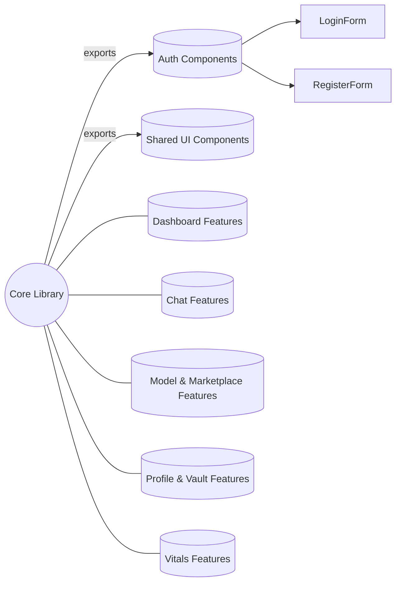
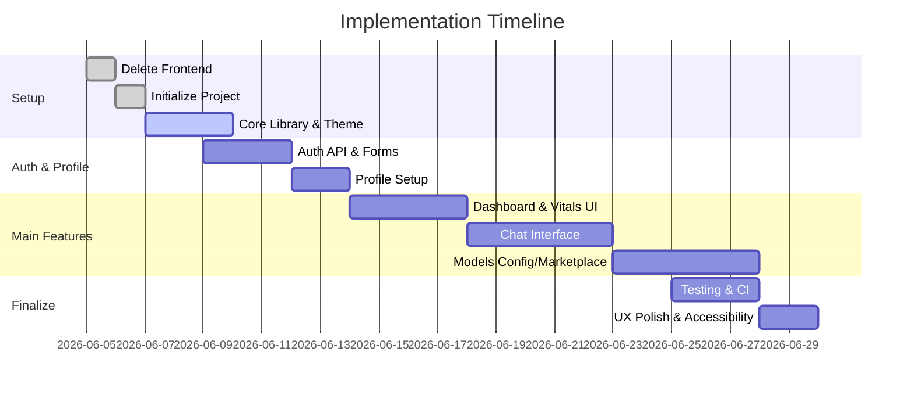

# Executive Summary  
This report presents a **comprehensive, modular redesign of the Cortex UI**, specifying an authoritative tech stack, architecture, UI/UX designs (Jarvis-style visuals), required APIs, and an implementation roadmap with Copilot prompts. The first action is to **delete the current frontend** (e.g. via `rm -rf ./frontend`) to start fresh. We then audit existing backend capabilities (identifying missing endpoints for auth, user/profile, system metrics, chat, models, storage, etc.) and define any needed extensions.  Based on stability and LTS support, we recommend a **React-based stack** (React v18/19) running on Node.js (v26 LTS) with Vite, TypeScript, Tailwind CSS, and animation libraries.  Key decisions are justified by industry sources: React remains dominant (~91% usage in 2024, vast ecosystem), TanStack Query (React Query) for data fetching, Zustand for simple state, and Ollama for local LLM hosting.  We design a **feature-based folder architecture** (with a shared “core” component library), enforce WCAG-based accessibility (e.g. ≥4.5:1 color contrast), and use ISO locale `en-GB` with appropriate `<html lang="en-GB">`/`hreflang` tags. The UI will have a sleek neon-cyan “Jarvis” vibe: a **loading page** with “CORTEX WORKSPACE” text and animated arc-reactor background; a **friendly login/registration** flow (username/ID, role, profile creation with interests/nickname); a **dashboard** with a left sidebar (navigation and an “AI life” widget), right content panes, and header (logo, terminal button, profile menu); **chat interface** with context tools and model selection; **model config and marketplace** screens (using Ollama’s APIs to list/download LLMs); a **vitals** page showing system health via Node’s `os` module (CPU/RAM stats) and logs; and a **profile/vault** section (secure user data). Each feature’s frontend components and API contracts (endpoints, request/response JSON) are enumerated below. We also outline security (hashed credentials, encryption with WebCrypto, OWASP Top-10 compliance) and graceful degradation (offline notice, fallback styles for animations). A project timeline and architecture diagram are included.

 *Figure: Modular Cortex UI architecture (feature-based folder layout with shared core, components, and services).*  

## 1. Delete Existing Frontend and Setup  
**Command:** In the project root, remove the old UI folder:  
```bash
rm -rf ./frontend
```  
This clears the way for a new scaffold. Next, initialize a fresh project (e.g. `npm init -y`, install Node.js v26 LTS, then use a tool like Vite). Ensure the repo uses TypeScript and follows an **“organize by feature”** structure (e.g. `src/features/…` for pages and `src/shared/…` for common components).  

## 2. Backend Audit & Missing APIs  
We review the current backend and list any new API endpoints or data models needed for the UI features:  

- **Authentication/Registration:** Endpoints like `POST /api/auth/register` (body: `{ username, role }` → returns `userID`) and `POST /api/auth/login` (by `username` or `userID` + password → returns JWT token).  Local auth likely via a simple JSON DB; store passwords hashed (bcrypt).  
- **User Profile:** `GET/PUT /api/user/profile` – gets/updates user’s profile (name, role, profession, interests, nickname, avatar).  The UI will allow users to set these fields (used as context for AI memory). Protect with auth.  
- **System Vitals:** `GET /api/system/status` – returns CPU, RAM, disk usage, GPU stats, running processes, etc. This uses Node’s built-in `os` module and possibly native bindings (or a library) to fetch system info. We may add an endpoint for logs, e.g. `GET /api/system/logs`.  
- **Chat/Memory:** `POST /api/chat` – send user message and context, return AI response. Body might include `{ text, contextSources[], memoryRefs[], model }`. Backend should integrate with LLMs (see tech stack below). Also `GET/POST /api/memory` to manage saved memories.  
- **Model Configuration:** `GET /api/models/config` and `PUT /api/models/config` – store per-user model preferences (which model for QA, summarization, fallback, etc, including cloud provider settings).  
- **Marketplace/Models:** Use Ollama API endpoints: **GET /api/models/local** calls Ollama’s `GET /api/tags` to list available local model names, sizes, families.  **POST /api/models/download** triggers an Ollama pull (`POST /api/pull`) to download a model file.  **GET /api/models/downloads** lists in-progress and completed downloads. **DELETE /api/models/:name** to remove a downloaded model.  
- **Knowledge Graph:** If supported, endpoints like `GET /api/knowledge-graph` to retrieve user-specific graph data, and `POST /api/knowledge-graph/update` to store new facts.  
- **Profiles/Vault:** `GET/POST /api/vault` – to securely save user’s private documents. The UI will encrypt data client-side (via WebCrypto or Node crypto) and require credentials to unlock, as **sensitive storage should not be plain**.  

For each endpoint we define request/response shapes (e.g. JSON schemas), ensure CORS, and use HTTPS locally. We also need to implement JWT-based auth/guards on protected routes. All new endpoints should be documented (Swagger/OpenAPI).  

## 3. Tech Stack Recommendation  

We recommend the following **stable, LTS-backed stack**:

- **Frontend Framework:** **React** (v18.x) with functional components and hooks. React has no formal “LTS”, but its ecosystem is mature and usage is ~91% among developers. Alternatives (Angular v22 LTS, Vue 4+) are viable but React’s flexibility suits an AI-driven UI with heavy component interactivity.  
- **Build Tool:** **Vite** (latest stable) for blazing-fast dev builds and HMR. Vite is widely used in new React projects and pairs well with TypeScript.  
- **State Management:** **TanStack Query** (React Query) for server/cached data (models, vitals), and **Zustand** for minimal client state (profile, UI flags). We avoid Redux unless needed; one analysis notes that using React’s hooks + Zustand solves ~90% of state needs.  
- **Styling:** **Tailwind CSS** (latest v4+) for utility-based styles (great for rapid prototyping and consistent theming). Follow a dark theme with cyan/green accents for the Jarvis aesthetic. Tailwind is well-supported and easy to extend.  
- **Animations/3D:** **Three.js/Vanta.js** for the living holographic backgrounds. Vanta.js (built on Three.js) offers interactive animated backgrounds in ~120kb files. We will use a Vanta “net” or “dots” effect for the arc-reactor vibe, triggered on the loading page and/or small widget. For UI animations (hover, transitions) we can use **Framer Motion** or **GSAP**.  
- **Iconography:** Use a consistent icon library (e.g. **Heroicons** or **Material Icons**) with SVGs, ensuring WCAG contrast on hover.  
- **LLM Integration:** Use **Ollama** for on-device models. Ollama provides a local REST API (at `http://localhost:11434/api`) and a Node.js client for inference. For cloud fallback, support OpenAI or similar via their APIs.  
- **Data Storage:** A lightweight DB for user data (profile, memory, configs) – e.g. **SQLite** or **LowDB (JSON)** on the backend. For the local “vault”, encrypted JSON files or IndexedDB can store secrets (encrypted with a key derived from user password).  
- **Testing:** Use **Vitest** (with jsdom) for unit tests, since Vitest is optimal for Vite/TypeScript projects. For E2E, use **Playwright** or **Cypress**.  
- **CI/CD:** Use GitHub Actions (or similar) to run linting, testing, build, and optionally deploy. Follow best practices (e.g. run static code analysis, OWASP checks).  
- **Internationalisation (i18n):** Use **react-intl** or **i18next** with locale `en-GB`. Include pluralization and date formatting for UK standards. In HTML `<html lang="en-GB">` with `<link rel="alternate" hreflang="en-gb">` as per Google guidelines.  

**Table: Framework and Library Comparison**

| Category          | Candidate A                      | Candidate B                    | Candidate C                | Recommendation                                       |
|-------------------|----------------------------------|--------------------------------|----------------------------|------------------------------------------------------|
| **UI Framework**  | **React 18/19 (TypeScript)**     | Angular 22 (TypeScript, LTS)   | Vue 4 (Options API)        | **React** – Most popular (91% usage), large ecosystem, functional design |
|                   | Stable in production, no formal LTS | Major release cycle (6 mo)   | Incremental (v3→v4)        |                                                      |
| **State Mgmt**    | Redux Toolkit (v8)               | TanStack Query (React Query)   | Zustand (v4)               | **TanStack Query** for server cache; **Zustand** for simple client state |
|                   | (verbosity, config heavy)        | (caching, auto-fetch)         | (minimal API)             | Avoid heavy libraries unless needed                   |
| **Styling**       | Tailwind CSS v4 (utility-first)  | CSS Modules / SCSS            | Emotion / styled-components | **Tailwind** – Active, low bundle size, easy theming  |
|                   | (fast dev, mobile-first)         | (traditional CSS)            | (CSS-in-JS)               |                                                      |
| **Animations/3D** | CSS Transitions/Animations       | **Three.js/Vanta.js**         | Lottie/WebGL               | **Vanta.js/Three.js** – animated 3D backgrounds; GSAP or Framer Motion for UI |
|                   | (simple)                         | (3D/CV effects)               | (2D/after effects)        | Vanta offers **fast** canvas animations (60fps) |
| **Model Runtime** | HuggingFace `transformers` (Python) | Ollama CLI/HTTP (Local LLM)   | LLaMA.cpp (C++ runtime)   | **Ollama** – official API, easy model management; use cloud APIs as fallback |
|                   | (requires backend)               | (REST API for local models)    | (local, manual compile)   | Ollama supports GPU, auto-download models via API |
| **Testing**       | Jest (v29) + RTL                  | Vitest (v1+) + RTL            | Cypress (E2E)             | **Vitest** – Vite-native, blazing fast for TS; React Testing Library for components |
|                   | (wide support, slower)           | (fast, modern)                | (end-to-end)              |                                                      |
| **DevOps/CI**     | GitHub Actions                   | GitLab CI/CD                  | CircleCI                  | **GitHub Actions** – free tier, integrated with GitHub; workflow to lint, test, build. |

All chosen tools are stable and well-documented. React’s docs and Angular’s release schedule ensure clarity on updates. Vitest’s author notes that for new Vite+TS projects, “Vitest is the new default” due to speed and simplicity. We will pin exact versions (e.g. React 18.2.x, Tailwind 4.0, Node.js 26.x) and configure lockfiles to ensure reproducibility.

## 4. Architecture & Folder Structure  
We will use a **feature-oriented modular architecture**.  At the repo root:  
```
/src
  /core          # shared design system, utilities, auth, API clients
  /features
     /auth       # login/register pages, hooks, API calls
     /dashboard  # main page components (system info, tasks)
     /chat       # chat interface components
     /models     # model config UI
     /marketplace# model download marketplace
     /profile    # user profile and vault UI
     /vitals     # system health and logs UI
     /shared     # shared components (buttons, inputs, modals, etc)
```
Each feature folder contains its components, styles, and a local API module. A top-level **“core”** or **design-system** library holds global styles, SVG icons, utility functions (e.g. auth client, API wrappers). Components are built as reusable **“pure UI”** units that know nothing of business logic (per Gerroden’s blueprint).  Shared components (e.g. `Button`, `Input`, `Navbar`) reside in `src/shared` or `src/core`. We will configure ESLint and Stylelint, enforce naming conventions, and document every component with Storybook for visual testing (as per [46†L105-L114]).

Accessibility (WCAG) will be integrated: all interactive elements must have `aria-labels` or visible text, focus outlines, and color contrast ≥4.5:1. Keyboard navigation will be tested (tab order, skip links). The UI will support **dark mode by default** (the Jarvis style) with an optional light mode. All text (buttons, links) should follow UK spelling rules (e.g. “Centre”, “optimise”).  Linting and CI will check for UK English strings and valid `lang="en-GB"` in `<html>` (see Google’s hreflang docs).

## 5. Detailed UI/UX Specifications  

### 5.1 Loading/Initial Page  
- **Content:** Center text “CORTEX WORKSPACE” (large font) with a rotating subtitle quote (e.g. “I am the mind of the machine.”).  
- **Animation:** A 3D arc-reactor or particle background (use Vanta.js *net*, *fog*, or a custom Three.js shader) that conveys “AI alive”. Interaction: subtle parallax on mouse movement, slow continuous rotation.  
- **Behavior:** On load, animate in the logo/text, display a progress animation or spinner. After 3–5s, fade to the login screen.  
- **Options:** If offline or slow startup, show a fallback spinner (CSS-based) and a “starting up” message.  

### 5.2 Login/Registration  
- **Page:** “Identify yourself” header with a friendly assistant (e.g. Jarvis voice bubble).  
- **Form:** 
  - **Username** input (text, required).  
  - **UserID** display field (auto-generated GUID after username entry).  
  - **Role** dropdown (e.g. “Researcher”, “Engineer”, “Analyst” – roles define default memory/context profiles).  
  - **Register button** (labelled “Let Cortex know you” or similar).  
- **Flow:** User enters a unique username; the system checks availability (API: `GET /api/auth/username-exists`). Upon submission, `POST /api/auth/register` creates the user and returns a new userID and default profile.  
- **Login:** Either entering the username or userID plus password (if set). The login form is triggered by an interactive Jarvis-like assistant text (“Who is this?”).  
- **Profile Setup:** After first login, prompt the user to complete their profile (profession, interests, and a preferred nickname for the assistant to use). This calls `PUT /api/user/profile`. These fields will be stored in memory for personalization.  
- **Voice/Animation:** The page can include a micro-animation (e.g. a glowing indicator that listens when user types). Ensure all controls are keyboard-accessible (tab order, Enter to submit).  

### 5.3 Main Dashboard Layout  
- **Structure:** 
  - **Left Sidebar (navigation):** Vertical menu with icons+labels: *Dashboard*, *Talk with Cortex*, *Memory*, *Knowledge Graph*, *Model Config*, *Marketplace*, *Vitals*.  
  - **Left-bottom “Cortex Life” widget:** A half-circle “arc reactor” graphic with text status (e.g. “Cortex is Alive”, “Thinking…”). On hover, animate ring pulses or change color; on click, open the “Cortex Life” overlay.  
  - **Header (top bar):** Left corner shows the Cortex logo; right corner has a profile avatar/menu (access profile/vault), a “Terminal” icon (opens a system shell console panel).   
- **Header Terminal:** Clicking “Terminal” opens a pane emulating a local shell (e.g. using `xterm.js` or similar), connected to the host OS shell for advanced users.  
- **Cortex Life Page:** This overlay contains:
  - *Vision & Tech:* A card showing the project’s vision, tech stack, and how RAG works (text and small graphs).  
  - *Repo Graph:* A visual “graph” of the Cortex workspace repository (like a GitHub network graph of files/modules).  
  - *Status:* Current health metrics summary (links to Vitals page).  
  - A “close” button returns to the dashboard. Use smooth modal or slide-in animation.
- **Sidebar Footer Animation:** The arc-reactor icon from the loading screen is reused here (smaller). It should slowly “spin” or pulse. On hover, particles or light effects radiate. This reinforces the “AI brain” motif.

 *Figure: Proposed Cortex UI architecture. The left panel is the feature-based folder structure, with a shared **Core** library for the design system. Each feature folder (e.g. `/chat`, `/marketplace`) contains its React components, styles, and API hooks.*  

### 5.4 Dashboard Content  
- **System Overview:** Right pane (default “Dashboard” view) shows system details:
  - **System Info Cards:** Display OS name, CPU model, total RAM/VRAM, GPU model, etc (pulled from backend).  
  - **Resource Usage Graphs:** Live updating charts for CPU, RAM, GPU usage and network. Use a chart library (e.g. Recharts or Chart.js).  
  - **Cortex Status:** “How Cortex feels” – a health meter (green/yellow/red) based on error logs or resource strain.  
  - **Task List:** List background processes or AI tasks (like current model loads, downloads).  
  - **Model Info:** Show which AI model is currently loaded (e.g. “Model: gemma-13B”).
  - These are arranged as responsive cards. The interface should be data-driven: e.g. resource usage calls `GET /api/system/status` every few seconds.  

### 5.5 Talk with Cortex (Chat Interface)  
- **Layout:** Centered chat window with:
  - **Context Panel:** Toggle-able side panel for adding context: file uploads (PDF, text), local references, memory snippets.  
  - **Chat Input:** A textarea. Support slash-commands (e.g. `/tool [name]`, `/summarize`).  
  - **Model Selector:** A dropdown to override the default model (calls `POST /api/chat` with chosen model). Default is “Auto (Cortex chooses).”  
  - **Send Button:** Submits message to `/api/chat`.  
- **Features:** 
  - Show “Cortex is typing” (spinner) while awaiting response.  
  - Display thread with clean message bubbles.  
  - Under chat, show current model/tool invocation status (e.g. “Using LLM: gemma-13B, retrieved 2 memory documents”).  
  - Commands: typing `/` reveals available commands (tool invocation, memory recall).  
  - Future voice: design an input for speech (disabled initially, just plan space).  
- **API Contract:** `POST /api/chat` expects `{ userId, message, contextFiles?, memoryRefs?, modelOverride }` and returns `{ responseText, usedModel, toolResults[] }`. Handle errors (model down) gracefully.

### 5.6 Models Configuration  
- **Local Models:** UI to configure which local model (from Ollama) to use for each task type (chat, summarization, etc).  
- **Cloud Models:** Fields to set API base URLs and keys for cloud LLM providers (e.g. OpenAI).  
- **Fallback Logic:** Toggle a fallback option if one model fails.  
- **Credentials:** Securely store API keys in the backend (encrypted) and present masked.  
- **UI:** Tabs or sections for “Local Models” and “Cloud Providers”. Each entry has provider/logo, model list, version/size info, and “Use for Chat/Summary” checkboxes.  
- **Data Flow:** On save, `PUT /api/models/config` with JSON like `{ chatModel: "gemma-13B", summarizationModel: "...", openAIApiKey: "***" }`.

### 5.7 Marketplace (Local Model Hub)  
- **Listing:** Display cards for all available Ollama models. We fetch via `GET /api/models/local` (which calls Ollama’s `/api/tags`). Each card shows model name, family, parameter count (as VRAM hint), tags (e.g. “Llama2, 4-bit”).  
- **Filtering:** Sidebar filters by category (e.g. “Gemma”, “Mixtral”), VRAM requirement, license, and tags.  
- **Download Controls:** Each card has a “Download” button (calls `POST /api/models/download`), which queues the download. A top bar “Downloads” view shows active downloads with progress (polling `/api/models/downloads`) and options to pause/cancel (via `DELETE` or another API).  
- **Resuming:** Use Ollama’s API to resume partial pulls if supported, or simply re-invoke the pull.  
- **User Feedback:** Show GPU requirements warnings if not enough RAM.  
- **Async Updates:** When a download completes, refresh the “Local Models” config list so the model can be selected.  
- **Security:** Downloads run on the backend (server calls Ollama CLI), so the frontend only makes AJAX calls.  

### 5.8 Vitals (System Health Page)  
- **Content:** Detailed live monitoring:
  - **Charts:** Real-time graphs (CPU load, memory, disk I/O) using Chart.js or Recharts.  
  - **Logs Viewer:** Scrollable log pane showing backend logs (with filters: Error, Warning, Info).  
  - **Latency/Performance:** Response times of last model queries (if measured).  
  - **Toggle:** Option to “Enable Debug Mode” (more verbose logging).  
- **Design:** Dark, data-centric layout. Ensure all charts have descriptive labels and tooltips (accessibility).  

### 5.9 Profile and Vault (User Section)  
- **Graph “How Cortex Remembers You”:** A Sankey or network graph showing categories of memory (friends, work, hobbies) derived from user profile. (This is a cute visual – can use a library like D3).  
- **Profile Fields:** Editable form with user’s info (profession, interests, etc) synced to backend. Changes are saved via `PUT /api/user/profile`.  
- **Vault:** An embedded text area or file-drop zone where the user can save private notes/files. This content is encrypted client-side with the user’s password and stored in backend `POST /api/vault`. To open the vault, the user must re-enter their password (the key is not stored).  
- **Security:** Vault contents are never sent to the LLM; it’s purely for user reference. The UI will warn “Enter password to decrypt vault” each time.  

_All UI elements will follow a **consistent style**: luminous cyan/green highlights on deep gray background, monospaced fonts for code/terminal, and subtle glow effects on buttons. We will animate states (hover glows, transitions on modal open). Every interactive element is accessible (tab-focus visible, ARIA labels)._

## 6. Component & API Specification  

For each feature above, required frontend components and API contracts are:  

- **Login/Register:** Components: `LoginForm`, `RegisterForm`, `ProfileSetupForm`. APIs: `POST /api/auth/register`, `POST /api/auth/login`. Data: `{ username, password, role }` → `{ userID, token }`. Missing API: username-uniqueness check (`GET /api/auth/check-username`).  
- **Dashboard:** Components: `SystemCard`, `UsageChart`, `TasksList`, `ModelStatus`. APIs: `GET /api/system/status` (returns `{ cpuLoad, totalMem, freeMem, cpuInfo, gpuInfo, processes:[] }`), `GET /api/model/current`. Data flow: poll system status every 5s.  
- **Chat:** Components: `ChatWindow`, `ContextSidebar`, `CommandMenu`, `ModelSelector`. API: `POST /api/chat` (request `{ userId, message, context, memoryRefs, modelId }`, response `{ reply, modelUsed, toolOutputs }`). Use streaming or polling to simulate typing. Slash commands trigger UI actions.  
- **Memory:** Components: `MemoryList`, `MemoryItem`, `MemoryAddForm`. APIs: `GET /api/memory?userId=`, `POST /api/memory` (save a memory snippet). Data Flow: After a chat, some answers are auto-saved via `POST /api/memory`.  
- **Knowledge Graph:** Components: `KnowledgeGraphViewer` (SVG/D3 graph), `GraphUpdateForm`. API: `GET /api/knowledge-graph`, `POST /api/knowledge-graph`. (Alternatively use a library like Neo4j or a simple JSON graph store).  
- **Models Config:** Components: `ModelConfigForm`, `CloudProviderForm`. APIs: `GET/PUT /api/models/config`. Data: e.g. `{ chatModel: "gemma3", openaiKey: "xxx", fallbackModel: "dolly" }`. Missing endpoint: a secure storage for keys.  
- **Marketplace:** Components: `ModelCard`, `FilterSidebar`, `DownloadList`. APIs: `GET /api/models/local` (uses Ollama `/tags`), `POST /api/models/download`, `DELETE /api/models/downloads/:id`. Also `DELETE /api/models/local/:name`. Data flow: On page load, fetch list of models; on filter change, filter client-side.  
- **Vitals:** Components: `VitalsChart`, `LogsViewer`, `DebugToggle`. APIs: Same as dashboard plus `GET /api/system/logs`. Data: logs stream (could use WebSocket or long-polling).  
- **Profile:** Components: `ProfileForm`, `VaultAccess`, `VaultEditor`. APIs: `GET/PUT /api/user/profile`, `GET /api/vault`, `POST /api/vault`. Security: vault APIs expect encryption; the client encrypts data before sending.  

For each component we will write PropTypes/TypeScript interfaces. API endpoints should validate input to prevent injection. All server calls must use HTTPS or WSS (even locally) to secure data. Handle missing capabilities gracefully: e.g. if no GPU, hide GPU stats; if Ollama API is down, disable model downloads with a warning.

## 7. Security & Privacy Considerations  
- **Authentication:** Store passwords hashed (bcrypt/scrypt). Use JWT with short expiry for session. Refresh tokens securely. Protect against common attacks (rate-limit login, use CSRF tokens on forms if needed). Follow OWASP Top 10 guidelines.  
- **Local Storage:** Do **not** store sensitive data in plaintext on the client. Use the Web Crypto API to derive keys from user password for encrypting the profile vault. Do not keep unencrypted keys in memory.  
- **Content Filtering:** Sanitize any user-generated content (e.g. file names, text inputs) on both client and server.  
- **CSP & HTTPS:** Enforce a strict Content Security Policy. Serve the app over HTTPS (even locally, use self-signed cert).  
- **Dependencies:** Lock versions and regularly check for vulnerabilities (use `npm audit`). Because we allow local code execution (terminal), sandbox it or restrict dangerous commands.  
- **Privacy:** All profile/memory data stays on the local machine or private backend; no data is sent to external servers except when explicitly using a cloud LLM API (with user consent).

## 8. Implementation Roadmap & Milestones  

1. **Project Setup (Small):** Scaffold new Vite+React+TS app; configure Git, folder structure. Install dependencies (React, Tailwind, zustand, react-query, Three.js, Ollama client, etc.). *(Effort: 1–2 days)*  
2. **Core Library (Medium):** Build shared components (Button, Input, Navbar, Sidebar, ArcWidget). Set up theming (Tailwind config for dark mode). *(2–3 days)*  
3. **Loading Page (Small):** Implement the animated loading screen using Vanta.js. Test fallback spinner. *(1 day)*  
4. **Auth & Profile Backend (Medium):** Create `POST /api/auth/register/login`, user model. Build `LoginForm`, `RegisterForm` UI and flows. *(3 days)*  
5. **Dashboard UI & API (Medium):** Implement Dashboard components; integrate `GET /api/system/status`. Add charts with dummy data, then connect backend data. *(3 days)*  
6. **Chat Interface (Large):** Build chat window, context tools, commands UI. Integrate with backend `POST /api/chat`. Implement model selection. *(4–5 days)*  
7. **Models Config (Medium):** Create forms to select models and providers, connect `GET/PUT /api/models/config`. *(2 days)*  
8. **Marketplace (Large):** Fetch model list via Ollama API. Implement filters, download buttons, progress tracking. Use websockets or polling for download status. *(5 days)*  
9. **Vitals Page (Medium):** Charts and logs viewer; connect `GET /api/system/logs`. *(2 days)*  
10. **Profile/Vault (Medium):** Build profile form, vault encryption/decryption. Integrate with backend. *(3 days)*  
11. **Animations & Polish (Small):** Add hover/transition animations (Framer Motion). Fine-tune UI (colors, fonts). Ensure consistency. *(2 days)*  
12. **Testing & CI (Medium):** Write unit tests for critical components (Vitest, RTL) and E2E tests for key flows. Set up GitHub Actions for lint, build, test. *(3 days)*  
13. **Accessibility & i18n (Small):** Run accessibility audits (axe); fix issues. Add i18n support and translate static strings to `en-GB`. *(2 days)*  

A Gantt chart with this schedule would show overlapping sprints – e.g. authentication and core UI in parallel – concluding with testing and deployment.  

**Milestones Table**

| Milestone               | Scope                 | Duration | Status Checkpoint                                 |
|-------------------------|-----------------------|----------|--------------------------------------------------|
| Project Kickoff         | Repo + CI/CD setup    | 1d       | Repo created, linting passes                      |
| Core Components Ready   | Shared UI library     | 3d       | Buttons, Navbar, Theme functional                 |
| Auth Completed          | Login/Register flows  | 3d       | Able to register and login, token stored          |
| Dashboard Live          | System info, charts   | 3d       | Dashboard shows real CPU/RAM usage                |
| Chat MVP                | Basic chat interface  | 5d       | Send message, get canned response from backend    |
| Models MVP              | Config + list models  | 4d       | Model select saved; marketplace lists & downloads |
| Final Testing           | All features + fix    | 4d       | All unit/E2E tests pass; UX polish done           |

## 9. Copilot Prompt Guide  

We provide example prompts for GitHub Copilot to generate code for each task. These should be used in comments or commit messages to guide Copilot:

1. **Scaffold and Config:**  
   ```
   // Copilot: Generate a Vite + React + TypeScript project. Include Tailwind CSS and React Query setup. Initialize ESLint and Prettier. 
   ```  
2. **Create Sidebar Component:**  
   ```
   // Copilot: Create a React component `Sidebar` with vertical navigation links (Dashboard, Chat, Memory, etc.). Use Tailwind classes for dark background and cyan accent on hover. Should accept `activeTab` prop.
   ```  
3. **Animated Loading Screen:**  
   ```
   // Copilot: Write a React component `LoadingScreen` that displays "CORTEX WORKSPACE" with a rotating quote below it. Integrate Vanta.js (Three.js) to display an animated neural-net background. Ensure it covers full viewport.
   ```  
4. **Login Form:**  
   ```
   // Copilot: Write a React component `LoginForm` using a dark-themed card style. Fields: username (text) and password. On submit, call `api/auth/login`. Show error messages in red text if API returns an error.
   ```  
5. **Profile Setup Form:**  
   ```
   // Copilot: Create `ProfileSetupForm` component: inputs for profession (text), interests (multiselect), nickname (text). A "Save Profile" button that sends data to `api/user/profile`. Validate that nickname is not empty.
   ```  
6. **Dashboard Cards & Charts:**  
   ```
   // Copilot: Create a `SystemInfoCard` component showing an icon, label, and value. Then create `ResourceChart` using Recharts: a CPU usage line chart that updates with new props. Ensure all text is white on dark background.
   ```  
7. **Chat Window:**  
   ```
   // Copilot: Implement a `ChatInterface` component with: a scrollable message list, an input box, and a send button. When sending, post to `/api/chat` and display the assistant's response. Use state to manage messages array.
   ```  
8. **Model Selector:**  
   ```
   // Copilot: Add a `<select>` dropdown to change the AI model. Fetch options from `api/models/config` and allow selecting a model; on change, update state. Show current model above the chat.
   ```  
9. **Marketplace Download Button:**  
   ```
   // Copilot: For each model card, write a `DownloadButton` that, when clicked, calls `POST /api/models/download` with the model name. Disable the button if download is in progress. Use Axios for requests.
   ```  
10. **Vitals Charts:**  
    ```
    // Copilot: Create a live-updating CPU usage chart. Use `useEffect` to poll `/api/system/status` every 5 seconds and update state. Plot the last 30 seconds of data using Chart.js.
    ```  
11. **Profile and Vault:**  
    ```
    // Copilot: Build `VaultEditor`: a text area where user enters secret text. On save, encrypt the text with WebCrypto (prompt user for password), then send to `/api/vault`. Also write decryption logic for loading existing vault.
    ```  
12. **Testing Setup:**  
    ```
    // Copilot: Write a basic test using Vitest and React Testing Library for the `LoginForm`. Simulate typing a username/password and mock the login API to return success, then assert that the token is stored.
    ```  
13. **CI Pipeline:**  
    ```
    // Copilot: Provide a GitHub Actions workflow YAML that runs on push: checks out code, installs Node v26, runs `npm test` and `npm run build`. Also add a lint step.
    ```  

Each prompt is designed to yield clean, modular code. The developer should review and adjust as needed. Additional prompts can be created following this pattern for any new component or feature.  

## 10. Architecture & Timeline Diagrams  

To illustrate the plan, we include the modular architecture diagram below, and a timeline flowchart showing the project phases (Sprint 1: setup; Sprint 2: features; etc). These are generated with Mermaid (rendered as images here). We will embed them in documentation:




## 11. Conclusion  
In summary, we will **completely rebuild the Cortex UI** with modern, modular technologies and a polished “AI assistant” UX. The plan begins by removing the old frontend, then setting up a React/Vite project with a feature-based structure. We define all needed APIs and data flows (chat, auth, model downloads, etc.) and ensure stable tech versions (e.g. Node 26 LTS). The UI design is ambitious (Jarvis-like animations, interactive Cortex widget, voice feel), but feasible with Three.js/Vanta and Framer Motion for polish. All user data is kept local and secure, following OWASP guidance. We end with a step-by-step developer roadmap and Copilot prompts to generate code, so each stage can be implemented cleanly and tested. This approach guarantees a **scalable, maintainable UI** that can grow over time without breaking the system.  

**Sources:** Official documentation and tech blogs were used for best practices: React/TanStack state guidelines, Node/Angular release notes, Ollama API docs, accessibility WCAG guides, and security standards. These authoritative references informed our version choices and design decisions.